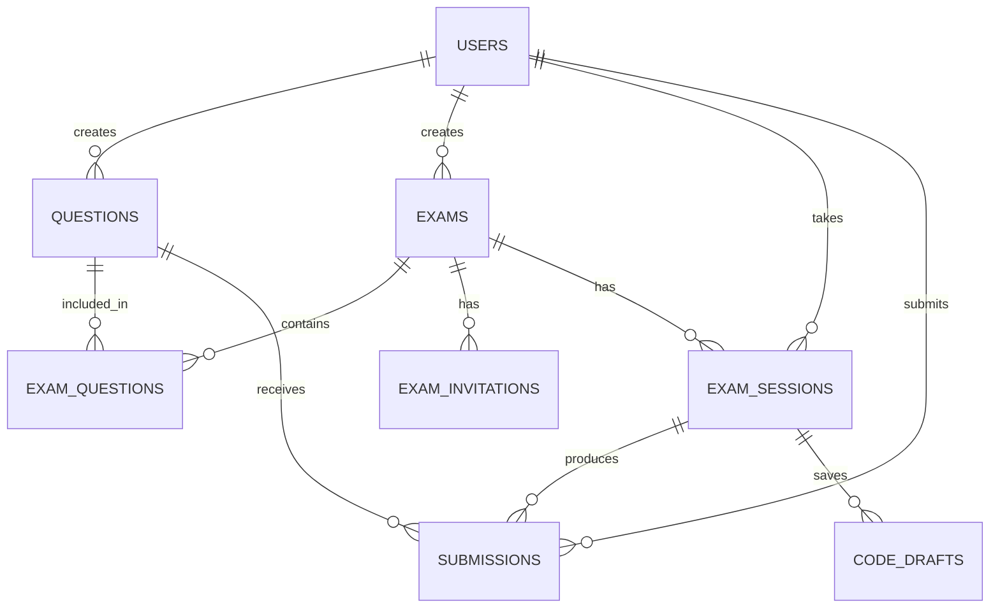

# Scaling & Full-Stack Migration Blueprint

> Comprehensive plan for evolving CodeAssess from a client-only exam simulator into
> a production-grade, multi-tenant online assessment platform with examiner and
> candidate roles, remote code execution, and enterprise-level security.

---

## Table of Contents

1. [Current State & Limitations](#1-current-state--limitations)
2. [Technology Decisions](#2-technology-decisions)
   - 2.1 [Backend Language & Framework](#21-backend-language--framework)
   - 2.2 [Database Strategy](#22-database-strategy)
   - 2.3 [Authentication Strategy](#23-authentication-strategy)
   - 2.4 [Judge Engine Strategy](#24-judge-engine-strategy)
3. [System Roles & Permissions](#3-system-roles--permissions)
4. [System Flow — Complete User Journeys](#4-system-flow--complete-user-journeys)
5. [Database Schema (Detailed)](#5-database-schema-detailed)
6. [API Design](#6-api-design)
7. [Remote Code Execution Architecture](#7-remote-code-execution-architecture)
8. [Real-Time Communication](#8-real-time-communication)
9. [Security & Anti-Cheating](#9-security--anti-cheating)
10. [Deployment & Infrastructure](#10-deployment--infrastructure)
11. [Migration Phases](#11-migration-phases)

---

## 1. Current State & Limitations

| Aspect | Current | Target |
|--------|---------|--------|
| Authentication | None | Role-based (Examiner + Candidate) |
| Data storage | `localStorage` + bundled JSON | PostgreSQL + Redis |
| Judge engine | Client-side (Pyodide WASM) | Server-side sandboxed Docker containers |
| Test case security | Visible in browser DevTools | Hidden server-side, never sent to client |
| Multi-language | Python only | Python, C++, Java, JavaScript, Go |
| Exam management | Hardcoded 37 questions | Dynamic question pool, custom exam creation |
| Collaboration | Single user | Multi-tenant: examiners create, candidates take |
| Analytics | None | Per-question, per-candidate, per-exam dashboards |
| Scalability | Single browser tab | Horizontally scalable microservices |

---

## 2. Technology Decisions

### 2.1 Backend Language & Framework

#### Candidates Evaluated

| Language | Framework | Strengths | Weaknesses | Verdict |
|----------|-----------|-----------|------------|---------|
| **Node.js** | NestJS / Fastify | Same ecosystem as Next.js frontend, massive npm ecosystem, excellent async I/O, native JSON handling, huge talent pool | Single-threaded CPU tasks, callback complexity in large codebases | ✅ **Primary API** |
| **Rust** | Axum / Actix-web | Blazing fast, memory-safe, zero-cost abstractions, ideal for sandboxed execution | Steep learning curve, slower development velocity, smaller web ecosystem | ✅ **Judge Worker** |
| **Go** | Gin / Echo | Excellent concurrency (goroutines), simple language, fast compilation, good Docker tooling | Less expressive type system, smaller web framework ecosystem than Node | ⚠️ Alternative for Judge Worker |
| **Python** | FastAPI / Django | Rapid development, rich data science ecosystem, excellent for prototyping | Slower execution, GIL limits concurrency, not ideal for high-throughput APIs | ❌ Not recommended for core API |
| **C++** | — | Maximum performance | Enormous development overhead, memory safety risks, no web ecosystem | ❌ Overkill |

#### Decision: Hybrid Architecture

```
┌──────────────────────────────────────────────────────────────────┐
│                    Architecture Overview                         │
│                                                                  │
│  ┌──────────────┐     ┌───────────────────┐     ┌─────────────┐  │
│  │  Next.js 16  │     │  Node.js (NestJS) │     │ Rust (Axum) │  │
│  │  Frontend    │────>│  API Gateway      │────>│ Judge Worker│  │
│  │  + SSR pages │     │  + Business Logic │     │ (Sandboxed) │  │
│  └──────────────┘     └───────────────────┘     └─────────────┘  │
│                                 │                                │
│                        ┌────────┴────────┐                       │
│                        │                 │                       │
│                  ┌─────▼──────┐   ┌──────▼───────┐               │
│                  │ PostgreSQL │   │    Redis     │               │
│                  │ (Primary)  │   │ (Cache/Queue)│               │
│                  └────────────┘   └──────────────┘               │
└──────────────────────────────────────────────────────────────────┘
```

**Rationale:**

1. **Next.js 16 (Frontend + SSR)** — Already in use. Handles landing pages, auth pages,
   examiner dashboard (SSR), and the candidate exam IDE (CSR). No change needed.

2. **Node.js with NestJS (API Server)** — Chosen because:
   - **Same language as the frontend** — TypeScript end-to-end reduces context switching
   - **NestJS provides structure** — Modules, guards, interceptors, pipes give enterprise-grade
     architecture out of the box (unlike Express which is unopinionated)
   - **Excellent ORM support** — Prisma or TypeORM for PostgreSQL
   - **WebSocket support** — Native `@nestjs/websockets` for real-time features
   - **Job queues** — Bull/BullMQ for judge job management
   - **Massive ecosystem** — Passport.js, class-validator, Swagger auto-generation

3. **Rust with Axum (Judge Worker)** — Chosen because:
   - **Performance-critical** — Judge workers process thousands of submissions per hour
   - **Memory safety without GC** — No garbage collection pauses during code execution timing
   - **Excellent process sandboxing** — Fine-grained control over child processes, namespaces, cgroups
   - **Docker SDK** — Bollard crate for container management
   - **Alternative: Go** — If the team lacks Rust expertise, Go (with its excellent concurrency
     model via goroutines) is a strong fallback. Go's `os/exec` package and Docker SDK are
     mature and well-documented.

> **⚠️ Pragmatic Note:** If the team is small or moving fast, the entire backend can start as
> **Node.js (NestJS) only** — using Docker containers spawned via `child_process` or the
> `dockerode` npm package for judging. Migrate the judge to Rust/Go only when throughput
> demands it (>500 concurrent submissions/minute).

---

### 2.2 Database Strategy

#### Decision: PostgreSQL + Redis (+ S3 for blobs)

```
┌───────────────────────────────────────────────────────────────────┐
│                      Data Layer Architecture                      │
│                                                                   │
│  ┌───────────────────┐  ┌──────────────┐  ┌───────────────────┐   │
│  │   PostgreSQL 16   │  │   Redis 7    │  │    S3 / MinIO     │   │
│  │                   │  │              │  │                   │   │
│  │  • Users          │  │  • Sessions  │  │  • Submission     │   │
│  │  • Questions      │  │  • JWT block │  │    code snapshots │   │
│  │  • Exams          │  │  • Rate limit│  │  • Exam exports   │   │
│  │  • Submissions    │  │  • Job queue │  │  • Profile images │   │
│  │  • Exam sessions  │  │  • Leaderbd  │  │                   │   │
│  │  • Invitations    │  │  • Cache     │  │                   │   │
│  │  • Audit logs     │  │              │  │                   │   │
│  └───────────────────┘  └──────────────┘  └───────────────────┘   │
│         │                     │                    │              │
│         │   ACID, Relations   │  Speed, Ephemeral  │  Large blobs │
└───────────────────────────────────────────────────────────────────┘
```

#### Why PostgreSQL (not MongoDB, not MySQL)

| Factor | PostgreSQL | MongoDB | MySQL |
|--------|-----------|---------|-------|
| **JSONB support** | ✅ Native, indexed | ✅ Native (BSON) | ⚠️ Limited JSON |
| **Complex queries** | ✅ CTEs, window functions, lateral joins | ⚠️ Aggregation pipeline is verbose | ✅ Good |
| **ACID transactions** | ✅ Full | ⚠️ Multi-doc transactions added late | ✅ Full |
| **Full-text search** | ✅ Built-in `tsvector` | ✅ Atlas Search | ⚠️ Basic |
| **Relational integrity** | ✅ Foreign keys, constraints | ❌ No enforced relations | ✅ Foreign keys |
| **Question/Exam data** | ✅ Structured + JSONB for flexible fields | ✅ Document model fits | ✅ Structured |
| **Submissions analytics** | ✅ Excellent (window funcs, aggregates) | ⚠️ Requires aggregation pipeline | ✅ Good |
| **Scaling** | ✅ Read replicas, partitioning, Citus | ✅ Native sharding | ✅ Read replicas |
| **Ecosystem** | ✅ Prisma, TypeORM, Drizzle | ✅ Mongoose | ✅ Prisma, TypeORM |

**Verdict:** PostgreSQL wins because our data is fundamentally **relational** (users create exams,
exams contain questions, candidates submit to questions within exam sessions) while still needing
flexibility for test cases and constraints (handled by JSONB columns). MongoDB's document model
is tempting for questions, but the relational integrity between users → exams → sessions →
submissions is critical and better enforced at the database level.

#### Why Redis (not just PostgreSQL for everything)

Redis serves **five distinct purposes** that PostgreSQL handles poorly:

| Purpose | Why Redis, Not Postgres |
|---------|------------------------|
| **Session store** | Sub-millisecond reads vs 2-5ms Postgres queries. Sessions are read on every request. |
| **JWT blocklist** | Revoked tokens need O(1) lookup. Redis TTL auto-expires them. |
| **Rate limiting** | Sliding window counters need atomic increment + TTL. Redis `INCR` + `EXPIRE` is perfect. |
| **Job queue** | BullMQ (judge jobs) requires Redis as its backing store. Postgres-based queues (e.g., pgBoss) add write amplification. |
| **Real-time cache** | Exam leaderboards, question stats, active user counts — all need fast read/write. |

#### Why S3/MinIO (for large blobs)

- Submission code snapshots (audit trail) can grow to millions of records
- Exam result exports (PDF/CSV) are generated async and stored
- Profile images
- PostgreSQL TOAST compression isn't designed for blob storage at scale

---

### 2.3 Authentication Strategy

#### Candidates Evaluated

| Approach | Pros | Cons |
|----------|------|------|
| **Firebase Auth** | Zero backend code for auth, handles OAuth/email/phone, real-time auth state, free tier generous | Vendor lock-in (Google), limited customization, harder to integrate with custom RBAC, data lives in Google Cloud, no self-hosting |
| **JWT + Custom (manual)** | Full control, no vendor lock-in, self-hosted | Significant implementation effort, must handle token refresh, revocation, password hashing, email verification manually |
| **NextAuth.js (Auth.js)** | Best Next.js integration, supports 50+ OAuth providers + credentials, JWT or database sessions, open source, self-hosted | Requires a database adapter, configuration can be complex for advanced RBAC |
| **Supabase Auth** | Built on GoTrue, includes RLS policies, good Postgres integration | Tied to Supabase ecosystem, less flexible than custom |

#### Decision: NextAuth.js (Auth.js) + JWT with Redis Blocklist

**Rationale:**

1. **NextAuth.js is the natural choice** for a Next.js 16 App Router project — it's
   maintained by the same Vercel ecosystem, has first-class App Router support, and
   handles the complex OAuth2/OIDC flows that we'd otherwise build from scratch.

2. **JWT tokens (not database sessions)** for the API layer because:
   - Stateless — no database lookup on every request
   - Works across microservices (the judge worker can verify tokens independently)
   - Short-lived access tokens (15 min) + long-lived refresh tokens (7 days)

3. **Redis blocklist for token revocation** — when a user logs out or an admin revokes
   access, the JWT `jti` (token ID) is added to a Redis set with TTL equal to the
   token's remaining lifetime. Middleware checks this blocklist on every request.

4. **Not Firebase** because:
   - Vendor lock-in is unacceptable for an assessment platform that may need to run
     on-premises for enterprise clients
   - Custom RBAC (examiner/candidate/admin) requires claims that Firebase custom claims
     handle awkwardly
   - We already have PostgreSQL — no need for a separate auth database

#### Auth Flow

```
 ┌──────────┐     ┌──────────────┐     ┌──────────────┐     ┌──────────┐
 │ Browser  │     │  Next.js     │     │  NestJS API  │     │  Redis   │
 │          │     │  (NextAuth)  │     │  (Gateway)   │     │          │
 └────┬─────┘     └───────┬──────┘     └───────┬──────┘     └─────┬────┘
      │   GET /auth/signin│                    │                  │
      │──────────────────>│                    │                  │
      │                   │                    │                  │
      │   OAuth redirect  │                    │                  │
      │<──────────────────│                    │                  │
      │                   │                    │                  │
      │   OAuth callback  │                    │                  │
      │──────────────────>│                    │                  │
      │                   │                    │                  │
      │                   │ Create/find user   │                  │
      │                   │ in PostgreSQL      │                  │
      │                   │───────────────────>│                  │
      │                   │                    │                  │
      │   Set JWT cookie  │                    │                  │
      │   (httpOnly,      │                    │                  │
      │    secure,        │                    │                  │
      │    sameSite)      │                    │                  │
      │<──────────────────│                    │                  │
      │                   │                    │                  │
      │   API request     │                    │                  │
      │   + JWT in cookie │                    │                  │
      │───────────────────────────────────────>│                  │
      │                   │                    │ Check blocklist  │
      │                   │                    │─────────────────>│
      │                   │                    │ Not blocked      │
      │                   │                    │<─────────────────│
      │                   │                    │                  │
      │                   │                    │ Verify JWT       │
      │                   │                    │ Extract role     │
      │                   │                    │ Check permissions│
      │   Response        │                    │                  │
      │<───────────────────────────────────────│                  │
```

#### Token Structure

```json
{
  "sub": "uuid-of-user",
  "email": "user@example.com",
  "name": "John Doe",
  "role": "examiner",
  "iat": 1711497600,
  "exp": 1711498500,
  "jti": "unique-token-id"
}
```

#### Supported Auth Methods (via NextAuth providers)

| Method | Provider | Use Case |
|--------|----------|----------|
| Google OAuth | `GoogleProvider` | Quick signup for candidates |
| GitHub OAuth | `GitHubProvider` | Developer-friendly signup |
| Email/Password | `CredentialsProvider` | Enterprise/institutional users |
| Magic Link | `EmailProvider` | Passwordless exam access |
| Exam Link Token | Custom | One-time exam access without account |

---

### 2.4 Judge Engine Strategy

| Phase | Engine | Use Case |
|-------|--------|----------|
| **Current** | Pyodide (browser WASM) | Python only, instant feedback, no server cost |
| **Phase 1** | Docker containers via API | Python, Java, C++, JS, Go — server-side, secure |
| **Phase 2** | Kubernetes Job workers | Auto-scaling, 1000+ concurrent submissions |
| **Hybrid** | Pyodide fallback | Offline mode, practice mode, development |

Detailed architecture in [Section 7](#7-remote-code-execution-architecture).

---

## 3. System Roles & Permissions

### Role Hierarchy

```
┌──────────────────────────────────────────────────────────────┐
│                        Admin                                 │
│  • Full platform access                                      │
│  • Manage all users, exams, questions                        │
│  • View platform analytics                                   │
│  • Configure system settings                                 │
│                                                              │
│  ┌────────────────────────┐  ┌────────────────────────────┐  │
│  │       Examiner         │  │        Candidate           │  │
│  │                        │  │                            │  │
│  │  • Create questions    │  │  • Browse public questions │  │
│  │  • Create/edit exams   │  │  • Practice (no time limit)│  │
│  │  • Invite candidates   │  │  • Join assigned exams     │  │
│  │  • Monitor live exams  │  │  • Submit solutions        │  │
│  │  • Review submissions  │  │  • View own results        │  │
│  │  • Export results      │  │  • View leaderboard        │  │
│  │  • View analytics      │  │                            │  │
│  └────────────────────────┘  └────────────────────────────┘  │
└──────────────────────────────────────────────────────────────┘
```

### Permission Matrix

| Resource | Action | Admin | Examiner | Candidate |
|----------|--------|-------|----------|-----------|
| **Users** | List all | ✅ | ❌ | ❌ |
| **Users** | View own profile | ✅ | ✅ | ✅ |
| **Questions** | Create | ✅ | ✅ (own) | ❌ |
| **Questions** | Edit/Delete | ✅ | ✅ (own) | ❌ |
| **Questions** | Browse public pool | ✅ | ✅ | ✅ |
| **Questions** | View hidden test cases | ✅ | ✅ (own) | ❌ |
| **Exams** | Create | ✅ | ✅ | ❌ |
| **Exams** | Edit/Delete | ✅ | ✅ (own) | ❌ |
| **Exams** | Invite candidates | ✅ | ✅ (own) | ❌ |
| **Exams** | Monitor live | ✅ | ✅ (own) | ❌ |
| **Exam Sessions** | Start | ✅ | ❌ | ✅ (if invited) |
| **Exam Sessions** | View results | ✅ | ✅ (own exams) | ✅ (own results) |
| **Submissions** | Submit code | ❌ | ❌ | ✅ (active session) |
| **Submissions** | Review any | ✅ | ✅ (own exams) | ❌ |
| **Submissions** | View own | ❌ | ❌ | ✅ |
| **Analytics** | Platform-wide | ✅ | ❌ | ❌ |
| **Analytics** | Own exams | ✅ | ✅ | ❌ |

---

## 4. System Flow — Complete User Journeys

### 4.1 Examiner Flow: Creating and Conducting an Exam

```
 Examiner                Platform                 Database
    │                       │                        │
    │  1. Sign up / Login   │                        │
    │──────────────────────>│                        │
    │                       │  Create user (role:    │
    │                       │  examiner)             │
    │                       │───────────────────────>│
    │                       │                        │
    │  2. Create Questions  │                        │
    │     (or select from   │                        │
    │      public pool)     │                        │
    │──────────────────────>│                        │
    │                       │  INSERT INTO questions │
    │                       │───────────────────────>│
    │                       │                        │
    │  3. Create Exam       │                        │
    │     • Title           │                        │
    │     • Duration        │                        │
    │     • Select questions│                        │
    │     • Scoring rules   │                        │
    │     • Start/end window│                        │
    │──────────────────────>│                        │
    │                       │  INSERT INTO exams     │
    │                       │  INSERT INTO           │
    │                       │   exam_questions       │
    │                       │───────────────────────>│
    │                       │                        │
    │  4. Configure Access  │                        │
    │     • Invite by email │                        │
    │     • Generate link   │                        │
    │     • Set passcode    │                        │
    │──────────────────────>│                        │
    │                       │  INSERT INTO           │
    │                       │   exam_invitations     │
    │                       │  Send invitation emails│
    │                       │───────────────────────>│
    │                       │                        │
    │  5. Share exam link   │                        │
    │     exam.codeassess.  │                        │
    │     io/join/abc123    │                        │
    │<──────────────────────│                        │
    │                       │                        │
    │  6. Monitor Live      │                        │
    │     • See who joined  │                        │
    │     • Real-time scores│                        │
    │     • Flag suspicious │                        │
    │       activity        │                        │
    │<─────────────────────>│  (WebSocket)           │
    │                       │                        │
    │  7. Export Results    │                        │
    │     • CSV / PDF       │                        │
    │     • Per-candidate   │                        │
    │       breakdown       │                        │
    │<──────────────────────│                        │
```

#### Exam Creation — Detailed Configuration

```
┌─────────────────────────────────────────────────────────────┐
│                    Create New Exam                          │
│                                                             │
│  Title:        [_____________________________]              │
│  Description:  [_____________________________]              │
│                                                             │
│  ┌─── Timing ──────────────────────────────────────┐        │
│  │  Duration:     [90] minutes                     │        │
│  │  Start window: [2026-04-01 09:00] to            │        │
│  │                [2026-04-01 11:00]               │        │
│  │  Late join:    [✓] Allow (up to 15 min)         │        │
│  └─────────────────────────────────────────────────┘        │
│                                                             │
│  ┌─── Questions ───────────────────────────────────┐        │
│  │  Source:  ( ) Public pool  (•) Custom           │        │
│  │                                                 │        │
│  │  Selected: 15 questions                         │        │
│  │  ┌──────────────────────────────────────────┐   │        │
│  │  │ ✓ Q1 Two Sum          Easy    100 pts    │   │        │
│  │  │ ✓ Q2 Binary Search    Easy    100 pts    │   │        │
│  │  │ ✓ Q3 LCS              Medium  150 pts    │   │        │
│  │  │   ...                                    │   │        │
│  │  └──────────────────────────────────────────┘   │        │
│  │                                                 │        │
│  │  Shuffle questions:  [✓ Yes]                    │        │
│  │  Shuffle test cases: [✓ Yes]                    │        │
│  └─────────────────────────────────────────────────┘        │
│                                                             │
│  ┌─── Access Control ─────────────────────────────┐         │
│  │  Mode: (•) Invite only  ( ) Public link        │         │
│  │                                                │         │
│  │  Invite candidates:                            │         │
│  │  [alice@corp.com, bob@corp.com, ...]           │         │
│  │                                                │         │
│  │  OR                                            │         │
│  │  Upload CSV: [Choose File]                     │         │
│  │                                                │         │
│  │  Passcode: [EXAM2026] (optional extra layer)   │         │
│  └────────────────────────────────────────────────┘         │
│                                                             │
│  ┌─── Proctoring ─────────────────────────────────┐         │
│  │  [✓] Full-screen mode required                 │         │
│  │  [✓] Tab switch detection                      │         │
│  │  [ ] Webcam monitoring                         │         │
│  │  [✓] Copy-paste disabled in editor             │         │
│  │  [✓] Log all focus/blur events                 │         │
│  └────────────────────────────────────────────────┘         │
│                                                             │
│               [ Cancel ]     [ Create Exam ]                │
└─────────────────────────────────────────────────────────────┘
```

### 4.2 Candidate Flow: Taking an Exam

```
 Candidate               Platform                 Judge Worker
    │                       │                        │
    │  1. Receive invite    │                        │
    │     (email with link) │                        │
    │                       │                        │
    │  2. Click exam link   │                        │
    │     /join/abc123      │                        │
    │──────────────────────>│                        │
    │                       │                        │
    │  3. Authenticate      │                        │
    │     (login or signup  │                        │
    │      if new user)     │                        │
    │──────────────────────>│                        │
    │                       │  Verify invitation     │
    │                       │  Check exam window     │
    │                       │  Create exam_session   │
    │                       │                        │
    │  4. Enter passcode    │                        │
    │     (if required)     │                        │
    │──────────────────────>│                        │
    │                       │                        │
    │  5. Exam lobby        │                        │
    │     • See rules       │                        │
    │     • System check    │                        │
    │     • Start button    │                        │
    │<──────────────────────│                        │
    │                       │                        │
    │  6. Start Exam        │                        │
    │──────────────────────>│                        │
    │                       │  Set session.status =  │
    │                       │  'active'              │
    │                       │  Record start_time     │
    │                       │                        │
    │  7. Solve questions   │                        │
    │     • Read problem    │                        │
    │     • Write code      │                        │
    │     • Code auto-saved │                        │
    │       every 30s       │                        │
    │──────────────────────>│                        │
    │                       │                        │
    │  8. Run Samples       │                        │
    │     (client-side      │                        │
    │      Pyodide for      │                        │
    │      instant feedback)│                        │
    │     [runs locally]    │                        │
    │                       │                        │
    │  9. Submit Solution   │                        │
    │──────────────────────>│  Enqueue judge job     │
    │                       │───────────────────────>│
    │                       │                        │ Spin up container
    │                       │                        │ Run all test cases
    │                       │                        │ (hidden + sample)
    │                       │     Results            │
    │                       │<───────────────────────│
    │   Score + verdict     │                        │
    │<──────────────────────│                        │
    │                       │  Save to submissions   │
    │                       │                        │
    │ 10. Timer expires     │                        │
    │     OR clicks "End"   │                        │
    │──────────────────────>│                        │
    │                       │  session.status =      │
    │                       │  'finished'            │
    │                       │                        │
    │ 11. View results      │                        │
    │<──────────────────────│                        │
```

### 4.3 Candidate Flow: Practice Mode (No Exam)

```
 Candidate               Platform
    │                       │
    │  1. Login             │
    │──────────────────────>│
    │                       │
    │  2. Browse public     │
    │     question pool     │
    │──────────────────────>│
    │                       │  GET /api/questions
    │                       │  ?visibility=public
    │                       │  (hidden_cases stripped)
    │                       │
    │  3. Select a question │
    │──────────────────────>│
    │                       │
    │  4. Solve + Submit    │
    │     (same as exam,    │
    │      but no timer,    │
    │      unlimited tries) │
    │──────────────────────>│
    │                       │
    │  5. View full results │
    │     + solution hints  │
    │     after submitting  │
    │<──────────────────────│
```

---

## 5. Database Schema (Detailed)

```sql
-- ═══════════════════════════════════════════════════════════════
--  CodeAssess — Full Database Schema (PostgreSQL 16)
-- ═══════════════════════════════════════════════════════════════

-- ─── ENUM Types ──────────────────────────────────────────────

CREATE TYPE user_role AS ENUM ('admin', 'examiner', 'candidate');
CREATE TYPE exam_status AS ENUM ('draft', 'published', 'active', 'closed', 'archived');
CREATE TYPE session_status AS ENUM ('pending', 'active', 'finished', 'timed_out', 'disqualified');
CREATE TYPE question_difficulty AS ENUM ('easy', 'medium', 'hard');
CREATE TYPE question_visibility AS ENUM ('public', 'private', 'exam_only');
CREATE TYPE submission_verdict AS ENUM ('AC', 'WA', 'TLE', 'RE', 'CE', 'PENDING');
CREATE TYPE invitation_status AS ENUM ('pending', 'accepted', 'expired', 'revoked');

-- ─── Users ───────────────────────────────────────────────────

CREATE TABLE users (
    id              UUID PRIMARY KEY DEFAULT gen_random_uuid(),
    email           VARCHAR(255) UNIQUE NOT NULL,
    name            VARCHAR(255) NOT NULL,
    password_hash   TEXT,                          -- NULL for OAuth-only users
    avatar_url      TEXT,
    role            user_role NOT NULL DEFAULT 'candidate',
    is_verified     BOOLEAN DEFAULT FALSE,
    last_login_at   TIMESTAMPTZ,
    created_at      TIMESTAMPTZ DEFAULT NOW(),
    updated_at      TIMESTAMPTZ DEFAULT NOW()
);

CREATE INDEX idx_users_email ON users(email);
CREATE INDEX idx_users_role ON users(role);

-- ─── Questions ───────────────────────────────────────────────

CREATE TABLE questions (
    id              SERIAL PRIMARY KEY,
    author_id       UUID REFERENCES users(id) ON DELETE SET NULL,
    title           VARCHAR(255) NOT NULL,
    slug            VARCHAR(255) UNIQUE NOT NULL,       -- URL-friendly identifier
    topic           VARCHAR(100) NOT NULL,
    difficulty      question_difficulty NOT NULL,
    visibility      question_visibility NOT NULL DEFAULT 'public',
    max_score       INT NOT NULL DEFAULT 100,
    time_limit_ms   INT NOT NULL DEFAULT 8000,          -- per-test-case timeout
    memory_limit_mb INT NOT NULL DEFAULT 256,

    -- Problem content
    scenario        TEXT,
    statement       TEXT NOT NULL,
    constraints     JSONB NOT NULL DEFAULT '[]',
    input_format    TEXT NOT NULL,
    output_format   TEXT NOT NULL,
    hint            TEXT,
    editorial       TEXT,                               -- Full solution explanation (visible after solve)

    -- Test cases
    sample_cases    JSONB NOT NULL,                     -- Sent to client
    hidden_cases    JSONB NOT NULL,                     -- NEVER sent to client

    -- Starter code per language
    starter_code    JSONB NOT NULL DEFAULT '{}',        -- {"python": "...", "cpp": "...", ...}

    -- Metadata
    solve_count     INT DEFAULT 0,
    attempt_count   INT DEFAULT 0,
    tags            TEXT[] DEFAULT '{}',

    created_at      TIMESTAMPTZ DEFAULT NOW(),
    updated_at      TIMESTAMPTZ DEFAULT NOW()
);

CREATE INDEX idx_questions_author ON questions(author_id);
CREATE INDEX idx_questions_difficulty ON questions(difficulty);
CREATE INDEX idx_questions_visibility ON questions(visibility);
CREATE INDEX idx_questions_tags ON questions USING GIN(tags);

-- ─── Exams ───────────────────────────────────────────────────

CREATE TABLE exams (
    id                  UUID PRIMARY KEY DEFAULT gen_random_uuid(),
    creator_id          UUID NOT NULL REFERENCES users(id) ON DELETE CASCADE,
    title               VARCHAR(255) NOT NULL,
    description         TEXT,
    status              exam_status NOT NULL DEFAULT 'draft',

    -- Timing
    duration_minutes    INT NOT NULL,
    start_window        TIMESTAMPTZ,                    -- Earliest a candidate can start
    end_window          TIMESTAMPTZ,                    -- Latest a candidate can start
    late_join_minutes   INT DEFAULT 0,                  -- Grace period after start_window

    -- Configuration
    shuffle_questions   BOOLEAN DEFAULT FALSE,
    shuffle_test_cases  BOOLEAN DEFAULT FALSE,
    show_scores         BOOLEAN DEFAULT TRUE,           -- Show score after each submit
    show_leaderboard    BOOLEAN DEFAULT FALSE,
    allow_practice_after BOOLEAN DEFAULT TRUE,          -- Allow review after exam ends
    passcode            VARCHAR(50),                    -- Optional access code

    -- Proctoring
    require_fullscreen  BOOLEAN DEFAULT TRUE,
    detect_tab_switch   BOOLEAN DEFAULT TRUE,
    disable_copy_paste  BOOLEAN DEFAULT FALSE,

    -- Allowed languages
    allowed_languages   TEXT[] DEFAULT '{python}',       -- e.g., {python, cpp, java}

    created_at          TIMESTAMPTZ DEFAULT NOW(),
    updated_at          TIMESTAMPTZ DEFAULT NOW()
);

CREATE INDEX idx_exams_creator ON exams(creator_id);
CREATE INDEX idx_exams_status ON exams(status);

-- ─── Exam ↔ Question Junction ────────────────────────────────

CREATE TABLE exam_questions (
    exam_id         UUID NOT NULL REFERENCES exams(id) ON DELETE CASCADE,
    question_id     INT NOT NULL REFERENCES questions(id) ON DELETE CASCADE,
    sort_order      INT NOT NULL DEFAULT 0,
    section         VARCHAR(10),                        -- e.g., 'A', 'B'
    max_score       INT,                                -- Override question's default score

    PRIMARY KEY (exam_id, question_id)
);

-- ─── Exam Invitations ────────────────────────────────────────

CREATE TABLE exam_invitations (
    id              UUID PRIMARY KEY DEFAULT gen_random_uuid(),
    exam_id         UUID NOT NULL REFERENCES exams(id) ON DELETE CASCADE,
    email           VARCHAR(255) NOT NULL,
    token           VARCHAR(64) UNIQUE NOT NULL,        -- Unique invitation token
    status          invitation_status NOT NULL DEFAULT 'pending',
    invited_at      TIMESTAMPTZ DEFAULT NOW(),
    accepted_at     TIMESTAMPTZ,
    expires_at      TIMESTAMPTZ,

    UNIQUE(exam_id, email)
);

CREATE INDEX idx_invitations_token ON exam_invitations(token);
CREATE INDEX idx_invitations_email ON exam_invitations(email);

-- ─── Exam Sessions (a candidate taking an exam) ─────────────

CREATE TABLE exam_sessions (
    id              UUID PRIMARY KEY DEFAULT gen_random_uuid(),
    exam_id         UUID NOT NULL REFERENCES exams(id) ON DELETE CASCADE,
    candidate_id    UUID NOT NULL REFERENCES users(id) ON DELETE CASCADE,
    status          session_status NOT NULL DEFAULT 'pending',

    started_at      TIMESTAMPTZ,
    finished_at     TIMESTAMPTZ,
    duration_used   INT,                                -- Actual seconds spent

    -- Proctoring data
    tab_switches    INT DEFAULT 0,
    focus_events    JSONB DEFAULT '[]',                -- [{type, timestamp}, ...]
    ip_address      INET,
    user_agent      TEXT,

    -- Scoring
    total_score     INT DEFAULT 0,
    rank            INT,                                -- Computed after exam closes

    created_at      TIMESTAMPTZ DEFAULT NOW(),

    UNIQUE(exam_id, candidate_id)                      -- One session per candidate per exam
);

CREATE INDEX idx_sessions_exam ON exam_sessions(exam_id);
CREATE INDEX idx_sessions_candidate ON exam_sessions(candidate_id);
CREATE INDEX idx_sessions_status ON exam_sessions(status);

-- ─── Submissions ─────────────────────────────────────────────

CREATE TABLE submissions (
    id              UUID PRIMARY KEY DEFAULT gen_random_uuid(),
    session_id      UUID REFERENCES exam_sessions(id) ON DELETE CASCADE,
    question_id     INT NOT NULL REFERENCES questions(id) ON DELETE CASCADE,
    candidate_id    UUID NOT NULL REFERENCES users(id) ON DELETE CASCADE,

    -- Code
    code            TEXT NOT NULL,
    language        VARCHAR(20) NOT NULL DEFAULT 'python',

    -- Results
    verdict         submission_verdict NOT NULL DEFAULT 'PENDING',
    score           INT NOT NULL DEFAULT 0,
    passed          INT NOT NULL DEFAULT 0,
    total           INT NOT NULL DEFAULT 0,
    max_execution_ms INT,                              -- Slowest test case
    max_memory_kb   INT,                               -- Peak memory usage
    test_results    JSONB,                             -- Per-test-case details

    -- Context
    is_practice     BOOLEAN DEFAULT FALSE,             -- TRUE if not part of an exam
    submitted_at    TIMESTAMPTZ DEFAULT NOW()
);

CREATE INDEX idx_submissions_session ON submissions(session_id);
CREATE INDEX idx_submissions_question ON submissions(question_id);
CREATE INDEX idx_submissions_candidate ON submissions(candidate_id);
CREATE INDEX idx_submissions_verdict ON submissions(verdict);

-- Best submission view (for scoring)
CREATE VIEW best_submissions AS
SELECT DISTINCT ON (session_id, question_id)
    id, session_id, question_id, candidate_id,
    code, language, verdict, score, passed, total, submitted_at
FROM submissions
WHERE session_id IS NOT NULL
ORDER BY session_id, question_id, score DESC, submitted_at ASC;

-- ─── Code Drafts (auto-saved) ────────────────────────────────

CREATE TABLE code_drafts (
    session_id      UUID NOT NULL REFERENCES exam_sessions(id) ON DELETE CASCADE,
    question_id     INT NOT NULL REFERENCES questions(id) ON DELETE CASCADE,
    code            TEXT NOT NULL,
    language        VARCHAR(20) NOT NULL DEFAULT 'python',
    updated_at      TIMESTAMPTZ DEFAULT NOW(),

    PRIMARY KEY (session_id, question_id)
);

-- ─── Audit Log ───────────────────────────────────────────────

CREATE TABLE audit_log (
    id              BIGSERIAL PRIMARY KEY,
    user_id         UUID REFERENCES users(id) ON DELETE SET NULL,
    action          VARCHAR(100) NOT NULL,              -- e.g., 'exam.created', 'submission.judged'
    resource_type   VARCHAR(50),                        -- e.g., 'exam', 'question', 'submission'
    resource_id     TEXT,
    metadata        JSONB,
    ip_address      INET,
    created_at      TIMESTAMPTZ DEFAULT NOW()
);

CREATE INDEX idx_audit_user ON audit_log(user_id);
CREATE INDEX idx_audit_action ON audit_log(action);
CREATE INDEX idx_audit_created ON audit_log(created_at);
```

### Schema Diagram (Relationships)



---

## 6. API Design

### Base URL Structure

```
/api/v1/
├── auth/
│   ├── POST   /signup                  # Create account (email/password)
│   ├── POST   /login                   # Authenticate
│   ├── POST   /logout                  # Revoke tokens
│   ├── POST   /refresh                 # Refresh access token
│   ├── POST   /forgot-password         # Send reset email
│   └── POST   /reset-password          # Reset with token
│
├── users/
│   ├── GET    /me                      # Current user profile
│   ├── PATCH  /me                      # Update profile
│   └── GET    /:id                     # Public profile (admin)
│
├── questions/
│   ├── GET    /                        # List (paginated, filtered)
│   ├── POST   /                        # Create (examiner+)
│   ├── GET    /:id                     # Get one (hidden_cases stripped for candidates)
│   ├── PATCH  /:id                     # Update (owner/admin)
│   └── DELETE /:id                     # Soft delete (owner/admin)
│
├── exams/
│   ├── GET    /                        # List own exams (examiner) / invited exams (candidate)
│   ├── POST   /                        # Create exam (examiner+)
│   ├── GET    /:id                     # Get exam details
│   ├── PATCH  /:id                     # Update (owner, if draft)
│   ├── DELETE /:id                     # Soft delete (owner/admin)
│   ├── POST   /:id/publish             # Publish exam (lock questions)
│   ├── POST   /:id/close               # Close exam manually
│   │
│   ├── POST   /:id/invite              # Invite candidates (email list)
│   ├── GET    /:id/invitations          # List invitations
│   ├── DELETE /:id/invitations/:invId   # Revoke invitation
│   │
│   ├── GET    /:id/sessions             # All sessions for this exam (examiner)
│   ├── GET    /:id/leaderboard          # Ranked results
│   └── GET    /:id/export               # CSV/PDF export
│
├── sessions/
│   ├── POST   /join/:token             # Join exam via invitation token
│   ├── POST   /:id/start               # Start exam timer
│   ├── POST   /:id/finish              # End exam
│   ├── GET    /:id                     # Session details + progress
│   └── GET    /:id/results             # Detailed results
│
├── submissions/
│   ├── POST   /                        # Submit code for judging
│   ├── GET    /:id                     # Get submission result
│   └── GET    /history                 # Own submission history
│
├── judge/
│   ├── POST   /run                     # Run against sample cases only (quick feedback)
│   └── POST   /submit                  # Full judge (all test cases, scored)
│
└── drafts/
    ├── PUT    /:sessionId/:questionId  # Auto-save code draft
    └── GET    /:sessionId/:questionId  # Retrieve saved draft
```

### API Response Format (Standardized)

```json
// Success
{
  "success": true,
  "data": { ... },
  "meta": {
    "page": 1,
    "total": 150,
    "per_page": 20
  }
}

// Error
{
  "success": false,
  "error": {
    "code": "EXAM_NOT_FOUND",
    "message": "Exam with the given ID does not exist.",
    "details": {}
  }
}
```

---

## 7. Remote Code Execution Architecture

### Architecture Overview

```
 ┌────────┐    ┌──────────────┐    ┌──────────┐    ┌──────────────────┐
 │ Client │───>│  API Server  │───>│  Redis   │───>│  Judge Workers   │
 │        │    │  (NestJS)    │    │  (Queue) │    │  (Rust/Go)       │
 │        │    │              │    │          │    │                  │
 │        │    │ POST /judge/ │    │ BullMQ   │    │ ┌──────────────┐ │
 │        │    │   submit     │    │ job queue│    │ │   Docker     │ │
 │        │    │              │    │          │    │ │  Container   │ │
 │        │    │  WebSocket   │<───│  pub/sub │<───│ │  (isolated)  │ │
 │        │<───│  (results)   │    │          │    │ │              │ │
 └────────┘    └──────────────┘    └──────────┘    │ │  python:3.11 │ │
                                                   │ │  OR gcc:13   │ │
                                                   │ │  OR openjdk  │ │
                                                   │ └──────────────┘ │
                                                   └──────────────────┘
```

### Execution Pipeline

```
Submission received
    │
    ▼
┌───────────────────────────────────────────────┐
│  1. Validation Layer                          │
│     • Code size < 50KB                        │
│     • Language is allowed for this exam       │
│     • Session is still active                 │
│     • Rate limit: max 1 submit per 5s         │
└──────────────────┬────────────────────────────┘
                   │
                   ▼
┌────────────────────────────────────────────────┐
│  2. Queue Layer (BullMQ + Redis)               │
│     • Job priority based on submission type    │
│       - "run" (samples only): HIGH priority    │
│       - "submit" (full judge): NORMAL priority │
│     • Job timeout: 120 seconds                 │
│     • Max retries: 1                           │
└──────────────────┬─────────────────────────────┘
                   │
                   ▼
┌────────────────────────────────────────────────┐
│  3. Worker Layer (Rust / Go)                   │
│     • Pull job from queue                      │
│     • Select Docker image by language          │
│     • For EACH test case:                      │
│       a. Create container                      │
│       b. Mount code as read-only volume        │
│       c. Pipe stdin, capture stdout/stderr     │
│       d. Enforce time limit (per test: 5s)     │
│       e. Enforce memory limit (256MB)          │
│       f. Compare output (normalized)           │
│       g. Destroy container                     │
│     • Aggregate results                        │
│     • Publish to Redis pub/sub                 │
└──────────────────┬─────────────────────────────┘
                   │
                   ▼
┌────────────────────────────────────────────────┐
│  4. Result Layer                               │
│     • Save to PostgreSQL (submissions table)   │
│     • Update exam_session.total_score          │
│     • Push via WebSocket to client             │
│     • Log to audit trail                       │
└────────────────────────────────────────────────┘
```

### Docker Container Security Config

```yaml
# Per-submission container spec
container:
  image: "codeassess/runner-python:3.11"    # Pre-built minimal images
  resources:
    cpu: "0.5"                               # 50% of one core
    memory: "256m"                            # Hard memory limit
    pids_limit: 64                            # Prevent fork bombs
  security:
    network_mode: "none"                     # NO network access
    read_only_rootfs: true                   # Cannot write to filesystem
    no_new_privileges: true                  # Cannot escalate privileges
    cap_drop: ["ALL"]                        # Drop all Linux capabilities
    seccomp_profile: "strict"                # Restrict syscalls
    user: "65534:65534"                      # Run as nobody
  timeouts:
    per_test: 5s                             # Individual test case
    total: 60s                               # All test cases combined
    startup: 3s                              # Container boot timeout
  volumes:
    - "/tmp/code_<id>:/code:ro"              # Read-only code mount
```

### Language Runner Images

| Language | Docker Image | Compile Command | Run Command |
|----------|-------------|-----------------|-------------|
| Python 3 | `python:3.11-alpine` | N/A | `python3 /code/solution.py` |
| C++ 17 | `gcc:13-bookworm` | `g++ -O2 -std=c++17 -o /tmp/sol /code/solution.cpp` | `/tmp/sol` |
| Java 17 | `eclipse-temurin:17-alpine` | `javac /code/Solution.java` | `java -cp /code Solution` |
| JavaScript | `node:20-alpine` | N/A | `node /code/solution.js` |
| Go 1.22 | `golang:1.22-alpine` | `go build -o /tmp/sol /code/solution.go` | `/tmp/sol` |
| Rust 1.77 | `rust:1.77-alpine` | `rustc -O -o /tmp/sol /code/solution.rs` | `/tmp/sol` |

### Hybrid Mode: Pyodide Fallback

```javascript
// lib/judge.js — Updated with hybrid execution
export async function executeSubmission(code, question, language, config) {
  // Practice mode or Python with instant feedback preference → Pyodide
  if (config.useFallback || (language === 'python' && config.preferLocal)) {
    return pyodideExecute(code, question);
  }

  // Exam mode → Remote judge (secure, hidden cases never leave server)
  const res = await fetch('/api/v1/judge/submit', {
    method: 'POST',
    headers: {
      'Content-Type': 'application/json',
      'Authorization': `Bearer ${getToken()}`,
    },
    body: JSON.stringify({
      questionId: question.id,
      sessionId: config.sessionId,
      code,
      language,
    }),
  });

  // Wait for results via WebSocket, or poll
  return waitForJudgeResult(res.json().jobId);
}
```

---

## 8. Real-Time Communication

### WebSocket Events

```
┌─────────────────────────────────────────────────────────────┐
│                    WebSocket Channels                       │
│                                                             │
│  exam:{examId}                (Examiner monitoring)         │
│  ├── candidate.joined         { candidateId, name, time }   │
│  ├── candidate.submitted      { candidateId, questionId,    │
│  │                              score }                     │
│  ├── candidate.finished       { candidateId, totalScore }   │
│  ├── leaderboard.updated      { rankings: [...] }           │
│  └── proctor.alert            { candidateId, type,          │
│                                 details }                   │
│                                                             │
│  session:{sessionId}          (Candidate's exam)            │
│  ├── judge.started            { submissionId }              │
│  ├── judge.progress           { submissionId, testCase,     │
│  │                              passed, total }             │
│  ├── judge.completed          { submissionId, verdict,      │
│  │                              score, results }            │
│  ├── timer.sync               { remaining }                 │
│  └── exam.force_end           { reason }                    │
│                                                             │
│  user:{userId}                (General notifications)       │
│  ├── exam.invitation          { examId, title, deadline }   │
│  └── notification             { message, type }             │
└─────────────────────────────────────────────────────────────┘
```

---

## 9. Security & Anti-Cheating

### 9.1 Test Case Protection

| Layer | Mechanism |
|-------|-----------|
| **API** | `hidden_cases` column is **never** included in API responses. A dedicated `QuestionResponseDTO` strips it. |
| **Judge** | Only the judge worker reads `hidden_cases` from the database. The API server itself never loads them into memory for client-facing routes. |
| **Frontend** | In exam mode, even `sample_cases` can be delivered one-at-a-time to prevent scraping. |

### 9.2 Anti-Cheating Measures

| Measure | Implementation | Detects |
|---------|---------------|---------|
| **Full-screen enforcement** | `document.fullscreenElement` check, warn on exit | Alt-tabbing to look up answers |
| **Tab switch detection** | `visibilitychange` event → log + warn after 3 switches | Switching to browser tabs |
| **Copy-paste blocking** | `onpaste` event prevention in CodeMirror | Pasting solutions from external sources |
| **Focus/blur logging** | All `focus`/`blur` events logged with timestamps to `exam_sessions.focus_events` | Pattern analysis for collusion |
| **IP fingerprinting** | Log IP + User-Agent per session | Detecting shared accounts |
| **Submission rate limiting** | Max 1 submission per 5 seconds per question | Brute-force testing |
| **Code similarity** | Post-exam MOSS or Dolos plagiarism detection | Copy between candidates |
| **Time anomaly detection** | Flag if solve time is < 10% of average for that question | Pre-prepared solutions |

### 9.3 Rate Limiting Strategy (Redis)

```
Per-user limits:
  /api/judge/run:      10 requests / 60 seconds
  /api/judge/submit:    5 requests / 60 seconds
  /api/questions:      60 requests / 60 seconds
  /api/auth/login:      5 requests / 300 seconds  (prevent brute force)

Per-IP limits:
  Global:             200 requests / 60 seconds
  /api/auth/*:         10 requests / 300 seconds
```

---

## 10. Deployment & Infrastructure

### Recommended Stack

| Component | Service | Rationale |
|-----------|---------|-----------|
| **Frontend** | Vercel | Native Next.js support, edge SSR, zero-config |
| **API Server** | Railway / Render / AWS ECS | NestJS container, auto-scaling |
| **Judge Workers** | AWS ECS / GCP GKE | Docker-in-Docker, dedicated compute, auto-scale |
| **PostgreSQL** | Supabase / Neon / AWS RDS | Managed, automated backups, read replicas |
| **Redis** | Upstash / AWS ElastiCache | Managed, serverless option for low traffic |
| **Object Storage** | AWS S3 / Cloudflare R2 | Code snapshots, exports, assets |
| **CDN** | Cloudflare | Pyodide WASM bundles, static assets |
| **Email** | Resend / AWS SES | Exam invitations, password resets |
| **Monitoring** | Sentry + Grafana | Error tracking + metrics dashboards |

### Scaling Numbers

| Tier | Concurrent Users | Judge Workers | PostgreSQL | Redis |
|------|-----------------|---------------|------------|-------|
| **MVP** | 50 | 2 | 1 (shared) | 1 (25MB) |
| **Growth** | 500 | 5-10 | 1 (dedicated) | 1 (100MB) |
| **Scale** | 5,000 | 20-50 | 1 primary + 2 read replicas | Cluster (3 nodes) |
| **Enterprise** | 50,000+ | 100+ (K8s auto-scale) | Citus (distributed) | Cluster (6+ nodes) |

---

## 11. Migration Phases

### Phase 1: Authentication & User Management (2-3 weeks)

- [ ] Set up NextAuth.js with Google + GitHub + Credentials providers
- [ ] Create `users` table in PostgreSQL
- [ ] Build sign-up / login / profile pages
- [ ] Implement JWT middleware with Redis blocklist
- [ ] Add role-based access control (examiner / candidate)
- [ ] Add protected routes in Next.js

### Phase 2: Question Bank & Practice Mode (2-3 weeks)

- [ ] Migrate questions from `questions.json` → PostgreSQL
- [ ] Build question CRUD API (`/api/v1/questions`)
- [ ] Build examiner dashboard: create/edit questions UI
- [ ] Build public question browser for candidates
- [ ] Implement practice mode (no timer, unlimited attempts)
- [ ] Swap `lib/api.js` to use real API endpoints

### Phase 3: Exam Management & Invitations (3-4 weeks)

- [ ] Build exam CRUD API with all configuration options
- [ ] Implement `exam_questions` junction (select/order questions)
- [ ] Build invitation system (email + unique tokens)
- [ ] Build exam join flow (token → auth → lobby → start)
- [ ] Build examiner dashboard: create exam wizard UI
- [ ] Implement `exam_sessions` lifecycle (pending → active → finished)
- [ ] Add auto-save drafts via API

### Phase 4: Remote Judge Engine (3-4 weeks)

- [ ] Build judge worker service (Rust or Go)
- [ ] Create Docker runner images for each language
- [ ] Set up BullMQ job queue with Redis
- [ ] Implement sandboxed execution with resource limits
- [ ] Add WebSocket layer for real-time results
- [ ] Implement hybrid mode (Pyodide fallback for practice)
- [ ] Load testing: verify 100+ concurrent submissions

### Phase 5: Monitoring & Analytics (2-3 weeks)

- [ ] Build live exam monitoring dashboard (WebSocket)
- [ ] Implement proctoring features (tab switch, fullscreen)
- [ ] Build results export (CSV/PDF)
- [ ] Add per-exam analytics (score distribution, time analysis)
- [ ] Implement leaderboard system
- [ ] Add audit logging for all critical operations

### Phase 6: Production Hardening (2 weeks)

- [ ] Security audit (OWASP top 10)
- [ ] Rate limiting on all endpoints
- [ ] Penetration testing on judge sandbox
- [ ] CDN setup for Pyodide WASM + static assets
- [ ] Automated backups + disaster recovery plan
- [ ] CI/CD pipeline (lint → test → build → deploy)
- [ ] Load testing at target scale

### Total Estimated Timeline: 14-19 weeks

```
Phase 1 ████████░░░░░░░░░░░░░░░░░░░░░░░░░░░░░░  Weeks 1-3
Phase 2 ░░░░░░░░████████░░░░░░░░░░░░░░░░░░░░░░░  Weeks 3-6
Phase 3 ░░░░░░░░░░░░░░░░████████████░░░░░░░░░░░  Weeks 6-10
Phase 4 ░░░░░░░░░░░░░░░░░░░░░░░░░░░░████████████  Weeks 10-14
Phase 5 ░░░░░░░░░░░░░░░░░░░░░░░░░░░░░░░░████████  Weeks 14-17
Phase 6 ░░░░░░░░░░░░░░░░░░░░░░░░░░░░░░░░░░░░████  Weeks 17-19
```
