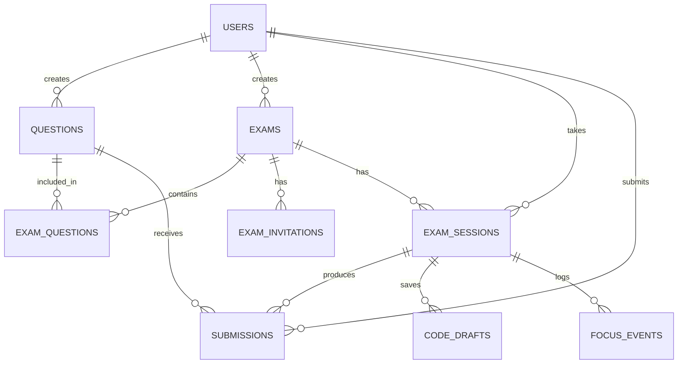

# Scaling & Full-Stack Migration Blueprint

> Comprehensive plan for evolving CodeAssess from a client-only exam simulator into
> a production-grade, multi-tenant online assessment platform with examiner and
> candidate roles, remote code execution, and enterprise-level security.

---

## Table of Contents

1. [Current State & Limitations](#1-current-state--limitations)
2. [Technology Decisions](#2-technology-decisions)
   - 2.1 [Backend Language & Framework](#21-backend-language--framework)
   - 2.2 [Database Strategy](#22-database-strategy)
   - 2.3 [Authentication Strategy](#23-authentication-strategy)
   - 2.4 [Judge Engine Strategy](#24-judge-engine-strategy)
3. [System Roles & Permissions](#3-system-roles--permissions)
4. [System Flow — Complete User Journeys](#4-system-flow--complete-user-journeys)
5. [Database Schema (Detailed)](#5-database-schema-detailed)
6. [Project Architecture](#6-project-architecture)
   - 6.1 [Next.js 16 — App Router Structure](#61-nextjs-16--app-router-structure)
   - 6.2 [NestJS — Module Architecture](#62-nestjs--module-architecture)
   - 6.3 [ORM & Migration Strategy](#63-orm--migration-strategy)
   - 6.4 [Configuration Management](#64-configuration-management)
7. [API Design](#7-api-design)
8. [Remote Code Execution Architecture](#8-remote-code-execution-architecture)
9. [Real-Time Communication](#9-real-time-communication)
10. [Security & Anti-Cheating](#10-security--anti-cheating)
11. [Deployment & Infrastructure](#11-deployment--infrastructure)
12. [Migration Phases](#12-migration-phases)

---

## 1. Current State & Limitations

| Aspect | Current | Target |
|--------|---------|--------|
| Authentication | None | Role-based (Examiner + Candidate) |
| Data storage | `localStorage` + bundled JSON | PostgreSQL + Redis |
| Judge engine | Client-side (Pyodide WASM) | Server-side sandboxed Docker containers |
| Test case security | Visible in browser DevTools | Hidden server-side, never sent to client |
| Multi-language | Python only | Python, C++, Java, JavaScript, Go |
| Exam management | Hardcoded 37 questions | Dynamic question pool, custom exam creation |
| Collaboration | Single user | Multi-tenant: examiners create, candidates take |
| Analytics | None | Per-question, per-candidate, per-exam dashboards |
| Scalability | Single browser tab | Horizontally scalable microservices |

---

## 2. Technology Decisions

### 2.1 Backend Language & Framework

#### Candidates Evaluated

| Language | Framework | Strengths | Weaknesses | Verdict |
|----------|-----------|-----------|------------|---------|
| **Node.js** | NestJS / Fastify | Same ecosystem as Next.js frontend, massive npm ecosystem, excellent async I/O, native JSON handling, huge talent pool | Single-threaded CPU tasks, callback complexity in large codebases | ✅ **Primary API** |
| **Rust** | Axum / Actix-web | Blazing fast, memory-safe, zero-cost abstractions, ideal for sandboxed execution | Steep learning curve, slower development velocity, smaller web ecosystem | ✅ **Judge Worker** |
| **Go** | Gin / Echo | Excellent concurrency (goroutines), simple language, fast compilation, good Docker tooling | Less expressive type system, smaller web framework ecosystem than Node | ⚠️ Alternative for Judge Worker |
| **Python** | FastAPI / Django | Rapid development, rich data science ecosystem, excellent for prototyping | Slower execution, GIL limits concurrency, not ideal for high-throughput APIs | ❌ Not recommended for core API |
| **C++** | — | Maximum performance | Enormous development overhead, memory safety risks, no web ecosystem | ❌ Overkill |

#### Decision: Hybrid Architecture

```
┌──────────────────────────────────────────────────────────────────┐
│                    Architecture Overview                         │
│                                                                  │
│  ┌──────────────┐     ┌───────────────────┐     ┌─────────────┐  │
│  │  Next.js 16  │     │  Node.js (NestJS) │     │ Rust (Axum) │  │
│  │  Frontend    │────>│  API Gateway      │────>│ Judge Worker│  │
│  │  + SSR pages │     │  + Business Logic │     │ (Sandboxed) │  │
│  └──────────────┘     └───────────────────┘     └─────────────┘  │
│                                 │                                │
│                        ┌────────┴────────┐                       │
│                        │                 │                       │
│                  ┌─────▼──────┐   ┌──────▼───────┐               │
│                  │ PostgreSQL │   │    Redis     │               │
│                  │ (Primary)  │   │ (Cache/Queue)│               │
│                  └────────────┘   └──────────────┘               │
└──────────────────────────────────────────────────────────────────┘
```

**Rationale:**

1. **Next.js 16 (Frontend + SSR)** — Already in use. Handles landing pages, auth pages,
   examiner dashboard (SSR), and the candidate exam IDE (CSR). No change needed.

2. **Node.js with NestJS (API Server)** — Chosen because:
   - **Same language as the frontend** — JavaScript/TypeScript end-to-end reduces context switching
   - **NestJS provides structure** — Modules, guards, interceptors, pipes give enterprise-grade
     architecture out of the box (unlike Express which is unopinionated)
   - **Excellent ORM support** — Prisma for PostgreSQL (schema-driven, migration-first)
   - **WebSocket support** — Native `@nestjs/websockets` for real-time features
   - **Job queues** — BullMQ for judge job management
   - **Massive ecosystem** — Passport.js, class-validator, Swagger auto-generation

3. **Rust with Axum (Judge Worker)** — Chosen because:
   - **Performance-critical** — Judge workers process thousands of submissions per hour
   - **Memory safety without GC** — No garbage collection pauses during code execution timing
   - **Excellent process sandboxing** — Fine-grained control over child processes, namespaces, cgroups
   - **Docker SDK** — Bollard crate for container management
   - **Alternative: Go** — If the team lacks Rust expertise, Go (with its excellent concurrency
     model via goroutines) is a strong fallback. Go's `os/exec` package and Docker SDK are
     mature and well-documented.

> **⚠️ Pragmatic Note:** If the team is small or moving fast, the entire backend can start as
> **Node.js (NestJS) only** — using Docker containers spawned via `dockerode` for judging.
> Migrate the judge to Rust/Go only when throughput demands it (>500 concurrent submissions/minute).

---

### 2.2 Database Strategy

#### Decision: PostgreSQL + Redis (+ S3 for blobs)

```
┌───────────────────────────────────────────────────────────────────┐
│                      Data Layer Architecture                      │
│                                                                   │
│  ┌───────────────────┐  ┌──────────────┐  ┌───────────────────┐   │
│  │   PostgreSQL 16   │  │   Redis 7    │  │    S3 / MinIO     │   │
│  │                   │  │              │  │                   │   │
│  │  • Users          │  │  • Sessions  │  │  • Submission     │   │
│  │  • Questions      │  │  • JWT block │  │    code snapshots │   │
│  │  • Exams          │  │  • Rate limit│  │  • Exam exports   │   │
│  │  • Submissions    │  │  • Job queue │  │  • Profile images │   │
│  │  • Exam sessions  │  │  • Leaderbd  │  │                   │   │
│  │  • Invitations    │  │  • Cache     │  │                   │   │
│  │  • Audit logs     │  │              │  │                   │   │
│  └───────────────────┘  └──────────────┘  └───────────────────┘   │
│         │                     │                    │              │
│         │   ACID, Relations   │  Speed, Ephemeral  │  Large blobs │
└───────────────────────────────────────────────────────────────────┘
```

#### Why PostgreSQL (not MongoDB, not MySQL)

| Factor | PostgreSQL | MongoDB | MySQL |
|--------|-----------|---------|-------|
| **JSONB support** | ✅ Native, indexed | ✅ Native (BSON) | ⚠️ Limited JSON |
| **Complex queries** | ✅ CTEs, window functions, lateral joins | ⚠️ Aggregation pipeline is verbose | ✅ Good |
| **ACID transactions** | ✅ Full | ⚠️ Multi-doc transactions added late | ✅ Full |
| **Full-text search** | ✅ Built-in `tsvector` | ✅ Atlas Search | ⚠️ Basic |
| **Relational integrity** | ✅ Foreign keys, constraints | ❌ No enforced relations | ✅ Foreign keys |
| **Question/Exam data** | ✅ Structured + JSONB for flexible fields | ✅ Document model fits | ✅ Structured |
| **Submissions analytics** | ✅ Excellent (window funcs, aggregates) | ⚠️ Requires aggregation pipeline | ✅ Good |
| **Scaling** | ✅ Read replicas, partitioning, Citus | ✅ Native sharding | ✅ Read replicas |
| **Ecosystem** | ✅ Prisma, TypeORM, Drizzle | ✅ Mongoose | ✅ Prisma, TypeORM |

**Verdict:** PostgreSQL wins because our data is fundamentally **relational** (users create exams,
exams contain questions, candidates submit to questions within exam sessions) while still needing
flexibility for test cases and constraints (handled by JSONB columns). MongoDB's document model
is tempting for questions, but the relational integrity between users → exams → sessions →
submissions is critical and better enforced at the database level.

#### Why Redis (not just PostgreSQL for everything)

Redis serves **five distinct purposes** that PostgreSQL handles poorly:

| Purpose | Why Redis, Not Postgres |
|---------|------------------------|
| **Session store** | Sub-millisecond reads vs 2-5ms Postgres queries. Sessions are read on every request. |
| **JWT blocklist** | Revoked tokens need O(1) lookup. One key per `jti` with TTL auto-expires them automatically. |
| **Rate limiting** | Sliding window counters need atomic increment + TTL. Redis `INCR` + `EXPIRE` is perfect. |
| **Job queue** | BullMQ (judge jobs) requires Redis as its backing store. Postgres-based queues add write amplification. |
| **Real-time cache** | Exam leaderboards, question stats, active user counts — all need fast read/write. |

> **JWT Blocklist Pattern:** Store revoked tokens as individual keys (`blocklist:{jti}` → `1`)
> with TTL set to the token's remaining lifetime. This is O(1) per lookup and self-cleaning —
> superior to storing all `jti` values in a Redis SET, which would grow indefinitely.

#### Why S3/MinIO (for large blobs)

- Submission code snapshots (audit trail) can grow to millions of records
- Exam result exports (PDF/CSV) are generated async and stored
- Profile images
- PostgreSQL TOAST compression isn't designed for blob storage at scale

---

### 2.3 Authentication Strategy

#### Candidates Evaluated

| Approach | Pros | Cons |
|----------|------|------|
| **Firebase Auth** | Zero backend code for auth, handles OAuth/email/phone, real-time auth state, free tier generous | Vendor lock-in (Google), limited customization, harder to integrate with custom RBAC, data lives in Google Cloud, no self-hosting |
| **JWT + Custom (manual)** | Full control, no vendor lock-in, self-hosted | Significant implementation effort, must handle token refresh, revocation, password hashing, email verification manually |
| **NextAuth.js (Auth.js)** | Best Next.js integration, supports 50+ OAuth providers + credentials, JWT or database sessions, open source, self-hosted | Requires a database adapter, configuration can be complex for advanced RBAC |
| **Supabase Auth** | Built on GoTrue, includes RLS policies, good Postgres integration | Tied to Supabase ecosystem, less flexible than custom |

#### Decision: NextAuth.js (Auth.js) + NestJS JWT Guard with Redis Blocklist

**Rationale:**

1. **NextAuth.js handles the OAuth flow** within Next.js. It is the natural choice for the
   App Router — it handles the complex OAuth2/OIDC redirect lifecycle, callback verification,
   CSRF protection, and session cookie management that would otherwise require significant
   custom code.

2. **Critical boundary:** NextAuth.js lives **entirely on the Next.js side**. The NestJS API
   is a separate service and must **not** depend on NextAuth.js internals. Instead:
   - NextAuth.js signs a short-lived JWT (access token) using a shared secret
   - The NestJS `JwtAuthGuard` independently validates that JWT using `@nestjs/jwt`
   - This keeps the API stateless and independently deployable

3. **JWT tokens (not database sessions)** for the API layer because:
   - Stateless — no database lookup on every request
   - Works across microservices (the judge worker can verify tokens independently)
   - Short-lived access tokens (15 min) + long-lived refresh tokens (7 days, stored httpOnly)

4. **Redis blocklist for token revocation** — on logout or admin revoke, the JWT `jti`
   (token ID) is stored as an individual Redis key (`blocklist:{jti}`) with TTL equal to
   the token's remaining lifetime. The NestJS `JwtAuthGuard` checks this key before
   processing any request. Expired entries self-delete via Redis TTL — no maintenance needed.

5. **Not Firebase** because:
   - Vendor lock-in is unacceptable for an assessment platform that may need on-premises
     deployment for enterprise clients
   - Custom RBAC (examiner/candidate/admin) requires claims that Firebase custom claims
     handle awkwardly
   - We already have PostgreSQL — no need for a separate auth database

#### Auth Architecture: Responsibility Split

```
┌─────────────────────────────────────────────────────────────────────┐
│                     Authentication Boundary                         │
│                                                                     │
│  ┌──────────────────────────┐    ┌──────────────────────────────┐   │
│  │     Next.js (Auth.js)    │    │      NestJS API              │   │
│  │                          │    │                              │   │
│  │  • OAuth redirect/cb     │    │  • JwtAuthGuard              │   │
│  │  • CSRF protection       │    │    (validates JWT via        │   │
│  │  • Session cookie        │    │     shared secret)           │   │
│  │  • Refresh token         │    │  • RolesGuard                │   │
│  │  • Signs access JWT      │    │  • Redis blocklist check     │   │
│  │    (shared secret) ──────┼───>│  • No NextAuth dependency    │   │
│  └──────────────────────────┘    └──────────────────────────────┘   │
└─────────────────────────────────────────────────────────────────────┘
```

#### Auth Flow

```
 ┌──────────┐     ┌──────────────┐     ┌──────────────┐     ┌──────────┐
 │ Browser  │     │  Next.js     │     │  NestJS API  │     │  Redis   │
 │          │     │  (Auth.js)   │     │  (Gateway)   │     │          │
 └────┬─────┘     └───────┬──────┘     └───────┬──────┘     └─────┬────┘
      │   GET /auth/signin│                    │                  │
      │──────────────────>│                    │                  │
      │                   │                    │                  │
      │   OAuth redirect  │                    │                  │
      │<──────────────────│                    │                  │
      │                   │                    │                  │
      │   OAuth callback  │                    │                  │
      │──────────────────>│                    │                  │
      │                   │ POST /api/v1/auth   │                  │
      │                   │   /sync-oauth-user  │                  │
      │                   │ (upsert user in PG) │                  │
      │                   │───────────────────>│                  │
      │                   │   { userId, role }  │                  │
      │                   │<───────────────────│                  │
      │                   │                    │                  │
      │   Set cookies:    │                    │                  │
      │   • access_token  │                    │                  │
      │     (JWT, 15min,  │                    │                  │
      │      httpOnly)    │                    │                  │
      │   • refresh_token │                    │                  │
      │     (JWT, 7d,     │                    │                  │
      │      httpOnly)    │                    │                  │
      │<──────────────────│                    │                  │
      │                   │                    │                  │
      │   API request     │                    │                  │
      │   + access_token  │                    │                  │
      │   cookie          │                    │                  │
      │───────────────────────────────────────>│                  │
      │                   │                    │ GET blocklist:   │
      │                   │                    │   {jti}          │
      │                   │                    │─────────────────>│
      │                   │                    │ (nil = not revkd)│
      │                   │                    │<─────────────────│
      │                   │                    │                  │
      │                   │                    │ Verify JWT sig   │
      │                   │                    │ Extract role     │
      │                   │                    │ RolesGuard check │
      │   Response        │                    │                  │
      │<───────────────────────────────────────│                  │
      │                   │                    │                  │
      │   POST /logout    │                    │                  │
      │──────────────────>│                    │                  │
      │                   │ POST /api/v1/auth   │                  │
      │                   │   /revoke           │                  │
      │                   │───────────────────>│                  │
      │                   │                    │ SET blocklist:   │
      │                   │                    │   {jti} 1        │
      │                   │                    │   EX {remaining} │
      │                   │                    │─────────────────>│
      │   Clear cookies   │                    │                  │
      │<──────────────────│                    │                  │
```

#### Token Structure

```json
{
  "sub": "018e5c4a-1234-7abc-9def-000000000001",
  "email": "user@example.com",
  "name": "John Doe",
  "role": "examiner",
  "iat": 1711497600,
  "exp": 1711498500,
  "jti": "unique-token-id-v4-uuid"
}
```

> **Note:** Keep JWT payloads minimal. Do not embed permissions or exam-specific data in
> the token — these are fetched from the database/cache when needed. Role is safe to include
> as it changes infrequently and its misuse only affects access until the token expires.

#### Supported Auth Methods (via Auth.js providers)

| Method | Provider | Use Case |
|--------|----------|----------|
| Google OAuth | `GoogleProvider` | Quick signup for candidates |
| GitHub OAuth | `GitHubProvider` | Developer-friendly signup |
| Email/Password | `CredentialsProvider` | Enterprise/institutional users |
| Magic Link | `EmailProvider` | Passwordless exam access |
| Exam Link Token | Custom | One-time exam access without account |

---

### 2.4 Judge Engine Strategy

| Phase | Engine | Use Case |
|-------|--------|----------|
| **Current** | Pyodide (browser WASM) | Python only, instant feedback, no server cost |
| **Phase 1** | Docker containers via API | Python, Java, C++, JS, Go — server-side, secure |
| **Phase 2** | Kubernetes Job workers | Auto-scaling, 1000+ concurrent submissions |
| **Hybrid** | Pyodide fallback | Offline mode, practice mode, development |

Detailed architecture in [Section 8](#8-remote-code-execution-architecture).

---

## 3. System Roles & Permissions

### Role Hierarchy

```
┌──────────────────────────────────────────────────────────────┐
│                        Admin                                 │
│  • Full platform access                                      │
│  • Manage all users, exams, questions                        │
│  • View platform analytics                                   │
│  • Configure system settings                                 │
│                                                              │
│  ┌────────────────────────┐  ┌────────────────────────────┐  │
│  │       Examiner         │  │        Candidate           │  │
│  │                        │  │                            │  │
│  │  • Create questions    │  │  • Browse public questions │  │
│  │  • Create/edit exams   │  │  • Practice (no time limit)│  │
│  │  • Invite candidates   │  │  • Join assigned exams     │  │
│  │  • Monitor live exams  │  │  • Submit solutions        │  │
│  │  • Review submissions  │  │  • View own results        │  │
│  │  • Export results      │  │  • View leaderboard        │  │
│  │  • View analytics      │  │                            │  │
│  └────────────────────────┘  └────────────────────────────┘  │
└──────────────────────────────────────────────────────────────┘
```

### Permission Matrix

| Resource | Action | Admin | Examiner | Candidate |
|----------|--------|-------|----------|-----------|
| **Users** | List all | ✅ | ❌ | ❌ |
| **Users** | View own profile | ✅ | ✅ | ✅ |
| **Questions** | Create | ✅ | ✅ (own) | ❌ |
| **Questions** | Edit/Delete | ✅ | ✅ (own) | ❌ |
| **Questions** | Browse public pool | ✅ | ✅ | ✅ |
| **Questions** | View hidden test cases | ✅ | ✅ (own) | ❌ |
| **Exams** | Create | ✅ | ✅ | ❌ |
| **Exams** | Edit/Delete | ✅ | ✅ (own) | ❌ |
| **Exams** | Invite candidates | ✅ | ✅ (own) | ❌ |
| **Exams** | Monitor live | ✅ | ✅ (own) | ❌ |
| **Exam Sessions** | Start | ✅ | ❌ | ✅ (if invited) |
| **Exam Sessions** | View results | ✅ | ✅ (own exams) | ✅ (own results) |
| **Submissions** | Submit code | ❌ | ❌ | ✅ (active session) |
| **Submissions** | Review any | ✅ | ✅ (own exams) | ❌ |
| **Submissions** | View own | ❌ | ❌ | ✅ |
| **Analytics** | Platform-wide | ✅ | ❌ | ❌ |
| **Analytics** | Own exams | ✅ | ✅ | ❌ |

---

## 4. System Flow — Complete User Journeys

### 4.1 Examiner Flow: Creating and Conducting an Exam

```
 Examiner                Platform                 Database
    │                       │                        │
    │  1. Sign up / Login   │                        │
    │──────────────────────>│                        │
    │                       │  Create user (role:    │
    │                       │  examiner)             │
    │                       │───────────────────────>│
    │                       │                        │
    │  2. Create Questions  │                        │
    │     (or select from   │                        │
    │      public pool)     │                        │
    │──────────────────────>│                        │
    │                       │  INSERT INTO questions │
    │                       │───────────────────────>│
    │                       │                        │
    │  3. Create Exam       │                        │
    │     • Title           │                        │
    │     • Duration        │                        │
    │     • Select questions│                        │
    │     • Scoring rules   │                        │
    │     • Start/end window│                        │
    │──────────────────────>│                        │
    │                       │  INSERT INTO exams     │
    │                       │  INSERT INTO           │
    │                       │   exam_questions       │
    │                       │───────────────────────>│
    │                       │                        │
    │  4. Configure Access  │                        │
    │     • Invite by email │                        │
    │     • Generate link   │                        │
    │     • Set passcode    │                        │
    │──────────────────────>│                        │
    │                       │  INSERT INTO           │
    │                       │   exam_invitations     │
    │                       │  Send invitation emails│
    │                       │───────────────────────>│
    │                       │                        │
    │  5. Share exam link   │                        │
    │     exam.codeassess.  │                        │
    │     io/join/abc123    │                        │
    │<──────────────────────│                        │
    │                       │                        │
    │  6. Monitor Live      │                        │
    │     • See who joined  │                        │
    │     • Real-time scores│                        │
    │     • Flag suspicious │                        │
    │       activity        │                        │
    │<─────────────────────>│  (WebSocket)           │
    │                       │                        │
    │  7. Export Results    │                        │
    │     • CSV / PDF       │                        │
    │     • Per-candidate   │                        │
    │       breakdown       │                        │
    │<──────────────────────│                        │
```

#### Exam Creation — Detailed Configuration

```
┌─────────────────────────────────────────────────────────────┐
│                    Create New Exam                          │
│                                                             │
│  Title:        [_____________________________]              │
│  Description:  [_____________________________]              │
│                                                             │
│  ┌─── Timing ──────────────────────────────────────┐        │
│  │  Duration:     [90] minutes                     │        │
│  │  Start window: [2026-04-01 09:00] to            │        │
│  │                [2026-04-01 11:00]               │        │
│  │  Late join:    [✓] Allow (up to 15 min)         │        │
│  └─────────────────────────────────────────────────┘        │
│                                                             │
│  ┌─── Questions ───────────────────────────────────┐        │
│  │  Source:  ( ) Public pool  (•) Custom           │        │
│  │                                                 │        │
│  │  Selected: 15 questions                         │        │
│  │  ┌──────────────────────────────────────────┐   │        │
│  │  │ ✓ Q1 Two Sum          Easy    100 pts    │   │        │
│  │  │ ✓ Q2 Binary Search    Easy    100 pts    │   │        │
│  │  │ ✓ Q3 LCS              Medium  150 pts    │   │        │
│  │  │   ...                                    │   │        │
│  │  └──────────────────────────────────────────┘   │        │
│  │                                                 │        │
│  │  Shuffle questions:  [✓ Yes]                    │        │
│  │  Shuffle test cases: [✓ Yes]                    │        │
│  └─────────────────────────────────────────────────┘        │
│                                                             │
│  ┌─── Access Control ─────────────────────────────┐         │
│  │  Mode: (•) Invite only  ( ) Public link        │         │
│  │                                                │         │
│  │  Invite candidates:                            │         │
│  │  [alice@corp.com, bob@corp.com, ...]           │         │
│  │                                                │         │
│  │  OR                                            │         │
│  │  Upload CSV: [Choose File]                     │         │
│  │                                                │         │
│  │  Passcode: [EXAM2026] (optional extra layer)   │         │
│  └────────────────────────────────────────────────┘         │
│                                                             │
│  ┌─── Proctoring ─────────────────────────────────┐         │
│  │  [✓] Full-screen mode required                 │         │
│  │  [✓] Tab switch detection                      │         │
│  │  [ ] Webcam monitoring                         │         │
│  │  [✓] Copy-paste disabled in editor             │         │
│  │  [✓] Log all focus/blur events                 │         │
│  └────────────────────────────────────────────────┘         │
│                                                             │
│               [ Cancel ]     [ Create Exam ]                │
└─────────────────────────────────────────────────────────────┘
```

### 4.2 Candidate Flow: Taking an Exam

```
 Candidate               Platform                 Judge Worker
    │                       │                        │
    │  1. Receive invite    │                        │
    │     (email with link) │                        │
    │                       │                        │
    │  2. Click exam link   │                        │
    │     /join/abc123      │                        │
    │──────────────────────>│                        │
    │                       │                        │
    │  3. Authenticate      │                        │
    │     (login or signup  │                        │
    │      if new user)     │                        │
    │──────────────────────>│                        │
    │                       │  Verify invitation     │
    │                       │  Check exam window     │
    │                       │  Create exam_session   │
    │                       │                        │
    │  4. Enter passcode    │                        │
    │     (if required)     │                        │
    │──────────────────────>│                        │
    │                       │                        │
    │  5. Exam lobby        │                        │
    │     • See rules       │                        │
    │     • System check    │                        │
    │     • Start button    │                        │
    │<──────────────────────│                        │
    │                       │                        │
    │  6. Start Exam        │                        │
    │──────────────────────>│                        │
    │                       │  Set session.status =  │
    │                       │  'active'              │
    │                       │  Record start_time     │
    │                       │                        │
    │  7. Solve questions   │                        │
    │     • Read problem    │                        │
    │     • Write code      │                        │
    │     • Code auto-saved │                        │
    │       every 30s       │                        │
    │──────────────────────>│                        │
    │                       │                        │
    │  8. Run Samples       │                        │
    │     (client-side      │                        │
    │      Pyodide for      │                        │
    │      instant feedback)│                        │
    │     [runs locally]    │                        │
    │                       │                        │
    │  9. Submit Solution   │                        │
    │──────────────────────>│  Enqueue judge job     │
    │                       │───────────────────────>│
    │                       │                        │ Spin up container
    │                       │                        │ Run all test cases
    │                       │                        │ (hidden + sample)
    │                       │     Results            │
    │                       │<───────────────────────│
    │   Score + verdict     │                        │
    │<──────────────────────│                        │
    │                       │  Save to submissions   │
    │                       │                        │
    │ 10. Timer expires     │                        │
    │     OR clicks "End"   │                        │
    │──────────────────────>│                        │
    │                       │  session.status =      │
    │                       │  'finished'            │
    │                       │                        │
    │ 11. View results      │                        │
    │<──────────────────────│                        │
```

### 4.3 Candidate Flow: Practice Mode (No Exam)

```
 Candidate               Platform
    │                       │
    │  1. Login             │
    │──────────────────────>│
    │                       │
    │  2. Browse public     │
    │     question pool     │
    │──────────────────────>│
    │                       │  GET /api/v1/questions
    │                       │  ?visibility=public
    │                       │  (hidden_cases stripped)
    │                       │
    │  3. Select a question │
    │──────────────────────>│
    │                       │
    │  4. Solve + Submit    │
    │     (same as exam,    │
    │      but no timer,    │
    │      unlimited tries) │
    │──────────────────────>│
    │                       │
    │  5. View full results │
    │     + solution hints  │
    │     after submitting  │
    │<──────────────────────│
```

---

## 5. Database Schema (Detailed)

```sql
-- ═══════════════════════════════════════════════════════════════
--  CodeAssess — Full Database Schema (PostgreSQL 16)
-- ═══════════════════════════════════════════════════════════════

-- ─── Extensions ──────────────────────────────────────────────

CREATE EXTENSION IF NOT EXISTS "pgcrypto";   -- gen_random_uuid()
CREATE EXTENSION IF NOT EXISTS "pg_trgm";    -- Trigram full-text search on titles/tags

-- ─── ENUM Types ──────────────────────────────────────────────

CREATE TYPE user_role             AS ENUM ('admin', 'examiner', 'candidate');
CREATE TYPE exam_status           AS ENUM ('draft', 'published', 'active', 'closed', 'archived');
CREATE TYPE session_status        AS ENUM ('pending', 'active', 'finished', 'timed_out', 'disqualified');
CREATE TYPE question_difficulty   AS ENUM ('easy', 'medium', 'hard');
CREATE TYPE question_visibility   AS ENUM ('public', 'private', 'exam_only');
CREATE TYPE submission_verdict    AS ENUM ('AC', 'WA', 'TLE', 'RE', 'CE', 'PENDING');
CREATE TYPE invitation_status     AS ENUM ('pending', 'accepted', 'expired', 'revoked');
CREATE TYPE focus_event_type      AS ENUM ('blur', 'focus', 'tab_switch', 'fullscreen_exit', 'paste_attempt');

-- ─── Auto-update timestamp trigger ───────────────────────────
-- Applied to every table with an updated_at column.

CREATE OR REPLACE FUNCTION set_updated_at()
RETURNS TRIGGER LANGUAGE plpgsql AS $$
BEGIN
  NEW.updated_at = NOW();
  RETURN NEW;
END;
$$;

-- ─── Users ───────────────────────────────────────────────────

CREATE TABLE users (
    id              UUID PRIMARY KEY DEFAULT gen_random_uuid(),
    email           VARCHAR(255) UNIQUE NOT NULL,
    name            VARCHAR(255) NOT NULL,
    password_hash   TEXT,                          -- NULL for OAuth-only users
    avatar_url      TEXT,
    role            user_role NOT NULL DEFAULT 'candidate',
    is_verified     BOOLEAN DEFAULT FALSE,
    last_login_at   TIMESTAMPTZ,
    deleted_at      TIMESTAMPTZ,                   -- Soft delete
    created_at      TIMESTAMPTZ DEFAULT NOW(),
    updated_at      TIMESTAMPTZ DEFAULT NOW()
);

CREATE INDEX idx_users_email      ON users(email) WHERE deleted_at IS NULL;
CREATE INDEX idx_users_role       ON users(role)  WHERE deleted_at IS NULL;

CREATE TRIGGER trg_users_updated_at
  BEFORE UPDATE ON users
  FOR EACH ROW EXECUTE FUNCTION set_updated_at();

-- ─── Questions ───────────────────────────────────────────────
-- NOTE: UUID primary key (not SERIAL) for consistency across all tables
-- and compatibility with distributed/sharded environments.

CREATE TABLE questions (
    id              UUID PRIMARY KEY DEFAULT gen_random_uuid(),
    author_id       UUID REFERENCES users(id) ON DELETE SET NULL,
    title           VARCHAR(255) NOT NULL,
    slug            VARCHAR(255) UNIQUE NOT NULL,       -- URL-friendly identifier
    topic           VARCHAR(100) NOT NULL,
    difficulty      question_difficulty NOT NULL,
    visibility      question_visibility NOT NULL DEFAULT 'public',
    max_score       INT NOT NULL DEFAULT 100,
    time_limit_ms   INT NOT NULL DEFAULT 8000,          -- per-test-case timeout
    memory_limit_mb INT NOT NULL DEFAULT 256,

    -- Problem content
    scenario        TEXT,
    statement       TEXT NOT NULL,
    constraints     JSONB NOT NULL DEFAULT '[]',
    input_format    TEXT NOT NULL,
    output_format   TEXT NOT NULL,
    hint            TEXT,
    editorial       TEXT,                               -- Full solution explanation

    -- Test cases
    sample_cases    JSONB NOT NULL DEFAULT '[]',        -- Sent to client
    hidden_cases    JSONB NOT NULL DEFAULT '[]',        -- NEVER sent to client

    -- Starter code per language
    starter_code    JSONB NOT NULL DEFAULT '{}',        -- {"python": "...", "cpp": "...", ...}

    -- Metadata
    solve_count     INT DEFAULT 0,
    attempt_count   INT DEFAULT 0,
    tags            TEXT[] DEFAULT '{}',

    deleted_at      TIMESTAMPTZ,                        -- Soft delete
    created_at      TIMESTAMPTZ DEFAULT NOW(),
    updated_at      TIMESTAMPTZ DEFAULT NOW()
);

CREATE INDEX idx_questions_author     ON questions(author_id) WHERE deleted_at IS NULL;
CREATE INDEX idx_questions_difficulty ON questions(difficulty) WHERE deleted_at IS NULL;
CREATE INDEX idx_questions_visibility ON questions(visibility) WHERE deleted_at IS NULL;
CREATE INDEX idx_questions_tags       ON questions USING GIN(tags);
CREATE INDEX idx_questions_slug       ON questions(slug);
-- Trigram index for fuzzy title search in the question browser
CREATE INDEX idx_questions_title_trgm ON questions USING GIN(title gin_trgm_ops);

CREATE TRIGGER trg_questions_updated_at
  BEFORE UPDATE ON questions
  FOR EACH ROW EXECUTE FUNCTION set_updated_at();

-- ─── Exams ───────────────────────────────────────────────────

CREATE TABLE exams (
    id                  UUID PRIMARY KEY DEFAULT gen_random_uuid(),
    creator_id          UUID NOT NULL REFERENCES users(id) ON DELETE CASCADE,
    title               VARCHAR(255) NOT NULL,
    description         TEXT,
    status              exam_status NOT NULL DEFAULT 'draft',

    -- Timing
    duration_minutes    INT NOT NULL,
    start_window        TIMESTAMPTZ,
    end_window          TIMESTAMPTZ,
    late_join_minutes   INT DEFAULT 0,

    -- Configuration
    shuffle_questions   BOOLEAN DEFAULT FALSE,
    shuffle_test_cases  BOOLEAN DEFAULT FALSE,
    show_scores         BOOLEAN DEFAULT TRUE,
    show_leaderboard    BOOLEAN DEFAULT FALSE,
    allow_practice_after BOOLEAN DEFAULT TRUE,
    passcode            VARCHAR(50),

    -- Proctoring
    require_fullscreen  BOOLEAN DEFAULT TRUE,
    detect_tab_switch   BOOLEAN DEFAULT TRUE,
    disable_copy_paste  BOOLEAN DEFAULT FALSE,

    -- Allowed languages
    allowed_languages   TEXT[] DEFAULT '{python}',

    deleted_at          TIMESTAMPTZ,                    -- Soft delete
    created_at          TIMESTAMPTZ DEFAULT NOW(),
    updated_at          TIMESTAMPTZ DEFAULT NOW()
);

CREATE INDEX idx_exams_creator ON exams(creator_id) WHERE deleted_at IS NULL;
CREATE INDEX idx_exams_status  ON exams(status)     WHERE deleted_at IS NULL;

CREATE TRIGGER trg_exams_updated_at
  BEFORE UPDATE ON exams
  FOR EACH ROW EXECUTE FUNCTION set_updated_at();

-- ─── Exam ↔ Question Junction ────────────────────────────────

CREATE TABLE exam_questions (
    exam_id         UUID NOT NULL REFERENCES exams(id) ON DELETE CASCADE,
    question_id     UUID NOT NULL REFERENCES questions(id) ON DELETE CASCADE,
    sort_order      INT NOT NULL DEFAULT 0,
    section         VARCHAR(10),
    max_score       INT,                                -- Overrides question's default

    PRIMARY KEY (exam_id, question_id)
);

-- Critical for ordered question fetching within an exam
CREATE INDEX idx_exam_questions_order ON exam_questions(exam_id, sort_order);

-- ─── Exam Invitations ────────────────────────────────────────

CREATE TABLE exam_invitations (
    id              UUID PRIMARY KEY DEFAULT gen_random_uuid(),
    exam_id         UUID NOT NULL REFERENCES exams(id) ON DELETE CASCADE,
    email           VARCHAR(255) NOT NULL,
    token           VARCHAR(64) UNIQUE NOT NULL,
    status          invitation_status NOT NULL DEFAULT 'pending',
    invited_at      TIMESTAMPTZ DEFAULT NOW(),
    accepted_at     TIMESTAMPTZ,
    expires_at      TIMESTAMPTZ,

    UNIQUE(exam_id, email)
);

CREATE INDEX idx_invitations_token ON exam_invitations(token);
CREATE INDEX idx_invitations_email ON exam_invitations(email);

-- ─── Exam Sessions ───────────────────────────────────────────

CREATE TABLE exam_sessions (
    id              UUID PRIMARY KEY DEFAULT gen_random_uuid(),
    exam_id         UUID NOT NULL REFERENCES exams(id) ON DELETE CASCADE,
    candidate_id    UUID NOT NULL REFERENCES users(id) ON DELETE CASCADE,
    status          session_status NOT NULL DEFAULT 'pending',

    started_at      TIMESTAMPTZ,
    finished_at     TIMESTAMPTZ,
    duration_used   INT,                                -- Actual seconds spent

    -- Proctoring summary (counts only; raw events in focus_events table)
    tab_switch_count    INT DEFAULT 0,
    fullscreen_exit_count INT DEFAULT 0,
    paste_attempt_count INT DEFAULT 0,
    ip_address          INET,
    user_agent          TEXT,

    -- Scoring
    total_score     INT DEFAULT 0,
    rank            INT,                                -- Computed after exam closes

    created_at      TIMESTAMPTZ DEFAULT NOW(),

    UNIQUE(exam_id, candidate_id)
);

CREATE INDEX idx_sessions_exam      ON exam_sessions(exam_id);
CREATE INDEX idx_sessions_candidate ON exam_sessions(candidate_id);
CREATE INDEX idx_sessions_status    ON exam_sessions(status);

-- ─── Focus Events (separate table — not JSONB in session row) ─
-- Storing an unbounded array of events as JSONB in exam_sessions
-- causes row bloat and makes per-event queries impossible.
-- A dedicated table is the correct relational pattern.

CREATE TABLE focus_events (
    id          BIGSERIAL PRIMARY KEY,
    session_id  UUID NOT NULL REFERENCES exam_sessions(id) ON DELETE CASCADE,
    event_type  focus_event_type NOT NULL,
    occurred_at TIMESTAMPTZ NOT NULL DEFAULT NOW(),
    metadata    JSONB                                   -- e.g., { "url": "...", "duration_ms": 800 }
);

CREATE INDEX idx_focus_events_session ON focus_events(session_id);
CREATE INDEX idx_focus_events_type    ON focus_events(session_id, event_type);

-- ─── Submissions ─────────────────────────────────────────────

CREATE TABLE submissions (
    id              UUID PRIMARY KEY DEFAULT gen_random_uuid(),
    session_id      UUID REFERENCES exam_sessions(id) ON DELETE CASCADE,
    question_id     UUID NOT NULL REFERENCES questions(id) ON DELETE CASCADE,
    candidate_id    UUID NOT NULL REFERENCES users(id) ON DELETE CASCADE,

    -- Code
    code            TEXT NOT NULL,
    language        VARCHAR(20) NOT NULL DEFAULT 'python',

    -- Results
    verdict         submission_verdict NOT NULL DEFAULT 'PENDING',
    score           INT NOT NULL DEFAULT 0,
    passed          INT NOT NULL DEFAULT 0,
    total           INT NOT NULL DEFAULT 0,
    max_execution_ms INT,
    max_memory_kb   INT,
    test_results    JSONB,                              -- Per-test-case details

    -- Context
    is_practice     BOOLEAN DEFAULT FALSE,
    submitted_at    TIMESTAMPTZ DEFAULT NOW()
);

CREATE INDEX idx_submissions_session   ON submissions(session_id);
CREATE INDEX idx_submissions_question  ON submissions(question_id);
CREATE INDEX idx_submissions_candidate ON submissions(candidate_id);
CREATE INDEX idx_submissions_verdict   ON submissions(verdict);

-- Best submission view (for scoring — highest score, earliest on tie)
CREATE VIEW best_submissions AS
SELECT DISTINCT ON (session_id, question_id)
    id, session_id, question_id, candidate_id,
    code, language, verdict, score, passed, total, submitted_at
FROM submissions
WHERE session_id IS NOT NULL
ORDER BY session_id, question_id, score DESC, submitted_at ASC;

-- ─── Code Drafts (auto-saved) ────────────────────────────────

CREATE TABLE code_drafts (
    session_id      UUID NOT NULL REFERENCES exam_sessions(id) ON DELETE CASCADE,
    question_id     UUID NOT NULL REFERENCES questions(id) ON DELETE CASCADE,
    code            TEXT NOT NULL,
    language        VARCHAR(20) NOT NULL DEFAULT 'python',
    updated_at      TIMESTAMPTZ DEFAULT NOW(),

    PRIMARY KEY (session_id, question_id)
);

CREATE TRIGGER trg_code_drafts_updated_at
  BEFORE UPDATE ON code_drafts
  FOR EACH ROW EXECUTE FUNCTION set_updated_at();

-- ─── Audit Log ───────────────────────────────────────────────

CREATE TABLE audit_log (
    id              BIGSERIAL PRIMARY KEY,
    user_id         UUID REFERENCES users(id) ON DELETE SET NULL,
    action          VARCHAR(100) NOT NULL,
    resource_type   VARCHAR(50),
    resource_id     UUID,                               -- UUID (not TEXT) — typed FK target
    metadata        JSONB,
    ip_address      INET,
    created_at      TIMESTAMPTZ DEFAULT NOW()
);

-- Partition by range on created_at for long-term retention (monthly partitions)
CREATE INDEX idx_audit_user    ON audit_log(user_id);
CREATE INDEX idx_audit_action  ON audit_log(action);
CREATE INDEX idx_audit_created ON audit_log(created_at);
```

### Schema Diagram (Relationships)



---

## 6. Project Architecture

### 6.1 Next.js 16 — App Router Structure (JavaScript)

The App Router collocates routes, layouts, loading states, and data-fetching logic. The structure
below enforces a clean separation between route segments (in `app/`), reusable components,
the API client layer, and global state.

> **Note:** The current project uses **JavaScript** (`.js`/`.jsx`) — not TypeScript. The NestJS
> API backend (Section 6.2) will use TypeScript, but the Next.js frontend remains JS unless a
> future migration to TypeScript is explicitly undertaken.

```
web/                               # Next.js 16 application (JavaScript)
├── src/
│   ├── app/
│   │   │
│   │   ├── (marketing)/           # Route group — public pages, no auth
│   │   │   ├── page.js            # Landing page (SSG)
│   │   │   ├── pricing/page.js
│   │   │   └── layout.js          # Marketing shell (no sidebar)
│   │   │
│   │   ├── (auth)/                # Route group — auth pages (no sidebar)
│   │   │   ├── login/
│   │   │   │   └── page.js
│   │   │   ├── signup/
│   │   │   │   └── page.js
│   │   │   └── layout.js
│   │   │
│   │   ├── (examiner)/            # Route group — examiner dashboard
│   │   │   ├── layout.js          # Examiner shell (sidebar, auth guard)
│   │   │   ├── dashboard/
│   │   │   │   └── page.js        # SSR: exam list, stats
│   │   │   ├── questions/
│   │   │   │   ├── page.js        # Question bank browser
│   │   │   │   ├── new/page.js    # Create question form
│   │   │   │   └── [id]/
│   │   │   │       ├── page.js    # View question
│   │   │   │       └── edit/page.js  # Edit question
│   │   │   └── exams/
│   │   │       ├── page.js        # Exam list
│   │   │       ├── new/page.js    # Create exam wizard
│   │   │       └── [id]/
│   │   │           ├── page.js    # Exam overview (SSR)
│   │   │           ├── monitor/   # Live monitoring (CSR, WebSocket)
│   │   │           │   └── page.js
│   │   │           └── results/   # Post-exam analytics (SSR)
│   │   │               └── page.js
│   │   │
│   │   ├── (candidate)/           # Route group — candidate experience
│   │   │   ├── layout.js          # Candidate shell (auth guard)
│   │   │   ├── practice/
│   │   │   │   ├── page.js        # Public question browser
│   │   │   │   └── [id]/page.jsx  # Practice IDE (CSR)
│   │   │   └── results/
│   │   │       └── [sessionId]/
│   │   │           └── page.js    # Post-exam results
│   │   │
│   │   ├── exam/                  # ← EXISTS TODAY (web/src/app/exam/page.js)
│   │   │   └── [sessionId]/
│   │   │       └── page.jsx       # Active exam IDE (CSR only, no SSR)
│   │   │
│   │   ├── join/
│   │   │   └── [token]/
│   │   │       └── page.js        # Invitation landing → lobby → start
│   │   │
│   │   ├── api/
│   │   │   └── auth/
│   │   │       └── [...nextauth]/
│   │   │           └── route.js   # Auth.js handler (Google, GitHub, Credentials)
│   │   │
│   │   ├── layout.js              # ← EXISTS TODAY — Root layout (fonts, providers, metadata)
│   │   ├── page.js                # ← EXISTS TODAY — Landing page
│   │   ├── globals.css            # ← EXISTS TODAY — Design tokens + global styles
│   │   ├── manifest.json          # ← EXISTS TODAY — PWA manifest
│   │   ├── favicon.ico            # ← EXISTS TODAY
│   │   ├── apple-icon.png         # ← EXISTS TODAY
│   │   ├── icon0.svg              # ← EXISTS TODAY
│   │   └── icon1.png              # ← EXISTS TODAY
│   │
│   ├── components/
│   │   ├── ui/                    # ← EXISTS TODAY — Reusable primitives
│   │   │   ├── Modal.jsx
│   │   │   ├── Spinner.jsx
│   │   │   ├── Toast.jsx
│   │   │   └── ...
│   │   ├── exam/                  # ← EXISTS TODAY — Exam IDE components
│   │   │   ├── ExamShell.jsx      # Grid layout orchestrator
│   │   │   ├── Header.jsx         # Timer, score, controls
│   │   │   ├── Sidebar.jsx        # Question navigator
│   │   │   ├── ProblemPanel.jsx   # Problem description
│   │   │   ├── CodePanel.jsx      # CodeMirror 6 editor
│   │   │   ├── OutputPanel.jsx    # Test results / console / custom input
│   │   │   └── ResultsScreen.jsx  # Post-exam results
│   │   └── shared/                # NEW — Cross-concern components
│   │       ├── AuthProvider.jsx   # Auth.js SessionProvider wrapper
│   │       └── QueryProvider.jsx  # TanStack Query setup
│   │
│   ├── context/                   # ← EXISTS TODAY
│   │   └── ExamContext.js         # useReducer-based exam state (→ Zustand in future)
│   │
│   ├── data/                      # ← EXISTS TODAY
│   │   └── questions.json         # 37 hardcoded questions (→ PostgreSQL in future)
│   │
│   ├── hooks/                     # ← EXISTS TODAY
│   │   ├── usePyodide.js          # Pyodide WASM lifecycle hook
│   │   └── useTimer.js            # Countdown timer hook
│   │
│   ├── lib/                       # ← EXISTS TODAY (will be expanded)
│   │   ├── api.js                 # ← EXISTS — Data fetching (currently local JSON)
│   │   ├── judge.js               # ← EXISTS — Pyodide judge engine wrapper
│   │   ├── api/                   # NEW — Structured API client (wraps fetch)
│   │   │   ├── client.js          # Base fetch with auth headers
│   │   │   ├── questions.js       # Questions API calls
│   │   │   ├── exams.js           # Exams API calls
│   │   │   ├── submissions.js     # Submissions API calls
│   │   │   └── index.js           # Re-exports
│   │   ├── auth/                  # NEW — Auth.js integration
│   │   │   ├── auth.config.js     # Auth.js providers + callbacks
│   │   │   └── session.js         # getServerSession helper
│   │   ├── hooks/                 # NEW — Refactored hooks
│   │   │   ├── useExamTimer.js
│   │   │   ├── useSubmission.js   # Polls / listens for judge results
│   │   │   ├── useAutoSave.js     # Debounced draft save
│   │   │   └── useWebSocket.js    # WebSocket wrapper
│   │   └── judge/                 # NEW — Judge module (absorbs existing judge.js)
│   │       └── pyodide.js         # Pyodide WASM wrapper (practice mode)
│   │
│   └── store/                     # NEW — Zustand global state (CSR only)
│       ├── examStore.js           # Active exam state (replaces ExamContext)
│       └── editorStore.js         # Per-question language / code state
│
├── public/
│   └── logo.svg                   # ← EXISTS TODAY — Platform logo
│
├── proxy.js                       # NEW — Next.js 16 request proxy (replaces middleware.js)
│                                  # Runs on Node.js runtime (NOT edge).
│                                  # Handles auth route protection and role-based redirects.
├── next.config.mjs                # ← EXISTS TODAY — Next.js config (ESM JavaScript)
├── jsconfig.json                  # ← EXISTS TODAY — Path aliases (@/)
├── eslint.config.mjs              # ← EXISTS TODAY
├── postcss.config.mjs             # ← EXISTS TODAY
└── package.json                   # ← EXISTS TODAY
```

#### Key Next.js 16 Architecture Decisions

| Decision | Choice | Rationale |
|----------|--------|-----------|
| **Language** | JavaScript (`.js`/`.jsx`) | Current project uses JS. TypeScript migration is optional and separate from this scaling plan. |
| **Data fetching (server)** | `async` Server Components + `fetch` with `use cache` | Next.js 16 Cache Components replace implicit ISR. Explicit `use cache` directive gives predictable, inspectable caching. |
| **Data fetching (client)** | TanStack Query | Caching, background refetch, optimistic updates for candidate interactions |
| **Global state** | Zustand | Lightweight, devtools support, no boilerplate — for exam IDE state only |
| **Route protection** | `proxy.js` (Node.js) + layout checks | Next.js 16 replaces `middleware.js` with `proxy.js`. Runs on Node.js (not edge). Layout checks add role enforcement. |
| **API client** | Thin wrapper over `fetch` | No heavy libraries; keeps bundle small; SSR + CSR compatible |
| **Styling** | Tailwind CSS v4 (CSS `@theme`) | Utility-first, config-less (Tailwind v4 uses CSS-native config via `@theme` in `globals.css`) |
| **Code editor** | CodeMirror 6 (`@uiw/react-codemirror`) | Best-in-class performance for large files, excellent language support. Already integrated. |
| **Bundler** | Turbopack (default in Next.js 16) | No config needed. Stable, 2–5× faster builds than webpack. Do not maintain a custom webpack config. |
| **React Compiler** | Enabled (stable in Next.js 16) | Auto-memoizes components — eliminates manual `useMemo`/`useCallback`. Set `reactCompiler: true` in `next.config.mjs`. |
| **Config format** | `next.config.mjs` (ESM JavaScript) | Current project uses JS ESM config. TypeScript config (`next.config.ts`) is also supported but not required. |

---

### 6.2 NestJS — Module Architecture

NestJS is organized around **feature modules**. Each module is a self-contained vertical slice
owning its controller, service, repository, DTOs, guards, and tests. Global cross-cutting
concerns live in `common/`.

```
apps/api/                          # NestJS application
├── src/
│   ├── main.ts                    # Bootstrap: Fastify adapter, global pipes, Swagger, CORS
│   ├── app.module.ts              # Root module — imports all feature modules
│   │
│   ├── config/                    # Configuration (validated at startup, fails fast)
│   │   ├── app.config.ts          # PORT, NODE_ENV, CORS_ORIGINS
│   │   ├── database.config.ts     # DATABASE_URL, pool settings
│   │   ├── redis.config.ts        # REDIS_URL
│   │   ├── jwt.config.ts          # JWT_SECRET, ACCESS_TTL, REFRESH_TTL
│   │   ├── s3.config.ts           # AWS_BUCKET, region, credentials
│   │   └── config.validation.ts   # Zod schema — process.env validated on boot
│   │
│   ├── common/                    # Global cross-cutting concerns
│   │   ├── decorators/
│   │   │   ├── current-user.decorator.ts  # @CurrentUser() param decorator
│   │   │   └── roles.decorator.ts         # @Roles('examiner') metadata decorator
│   │   ├── filters/
│   │   │   └── http-exception.filter.ts   # Uniform error shape for all exceptions
│   │   ├── guards/
│   │   │   ├── jwt-auth.guard.ts          # Validates JWT + checks Redis blocklist
│   │   │   └── roles.guard.ts             # Reads @Roles() metadata, checks JWT role
│   │   ├── interceptors/
│   │   │   ├── response-transform.interceptor.ts  # Wraps { success, data, meta }
│   │   │   └── logging.interceptor.ts             # Structured request/response logs
│   │   ├── pipes/
│   │   │   └── zod-validation.pipe.ts     # Validates DTOs with Zod schemas
│   │   └── middleware/
│   │       └── request-id.middleware.ts   # Injects X-Request-ID for tracing
│   │
│   ├── database/                  # Prisma setup
│   │   ├── prisma.service.ts      # PrismaClient singleton with lifecycle hooks
│   │   ├── prisma.module.ts       # Global module — no need to import per feature
│   │   └── migrations/            # Prisma migration files (source-controlled)
│   │
│   ├── redis/                     # Redis setup
│   │   ├── redis.service.ts       # ioredis client wrapper
│   │   └── redis.module.ts        # Global module
│   │
│   ├── modules/
│   │   │
│   │   ├── auth/                  # Authentication & token management
│   │   │   ├── auth.module.ts
│   │   │   ├── auth.controller.ts # POST /auth/* (login, signup, refresh, revoke)
│   │   │   ├── auth.service.ts    # Password hash, token issue/revoke, OAuth sync
│   │   │   ├── strategies/
│   │   │   │   └── jwt.strategy.ts      # Passport JWT strategy (reads cookie)
│   │   │   ├── dto/
│   │   │   │   ├── login.dto.ts
│   │   │   │   ├── signup.dto.ts
│   │   │   │   └── token-response.dto.ts
│   │   │   └── auth.service.spec.ts
│   │   │
│   │   ├── users/
│   │   │   ├── users.module.ts
│   │   │   ├── users.controller.ts  # GET /users/me, PATCH /users/me
│   │   │   ├── users.service.ts
│   │   │   ├── dto/
│   │   │   │   ├── update-user.dto.ts
│   │   │   │   └── user-response.dto.ts   # Strips password_hash from responses
│   │   │   └── users.service.spec.ts
│   │   │
│   │   ├── questions/
│   │   │   ├── questions.module.ts
│   │   │   ├── questions.controller.ts
│   │   │   ├── questions.service.ts
│   │   │   ├── dto/
│   │   │   │   ├── create-question.dto.ts
│   │   │   │   ├── update-question.dto.ts
│   │   │   │   └── question-response.dto.ts  # NEVER includes hidden_cases
│   │   │   └── questions.service.spec.ts
│   │   │
│   │   ├── exams/
│   │   │   ├── exams.module.ts
│   │   │   ├── exams.controller.ts
│   │   │   ├── exams.service.ts
│   │   │   ├── dto/
│   │   │   │   ├── create-exam.dto.ts
│   │   │   │   ├── update-exam.dto.ts
│   │   │   │   └── exam-response.dto.ts
│   │   │   └── exams.service.spec.ts
│   │   │
│   │   ├── invitations/
│   │   │   ├── invitations.module.ts
│   │   │   ├── invitations.controller.ts  # POST /exams/:id/invite, DELETE /.../:invId
│   │   │   ├── invitations.service.ts     # Token generation, email dispatch
│   │   │   └── dto/
│   │   │       ├── invite-candidates.dto.ts
│   │   │       └── invitation-response.dto.ts
│   │   │
│   │   ├── sessions/
│   │   │   ├── sessions.module.ts
│   │   │   ├── sessions.controller.ts     # POST /join/:token, POST /:id/start|finish
│   │   │   ├── sessions.service.ts        # Session lifecycle, scoring, rank compute
│   │   │   └── dto/
│   │   │       └── session-response.dto.ts
│   │   │
│   │   ├── submissions/
│   │   │   ├── submissions.module.ts
│   │   │   ├── submissions.controller.ts
│   │   │   ├── submissions.service.ts     # Enqueue to BullMQ, save results
│   │   │   └── dto/
│   │   │       ├── create-submission.dto.ts
│   │   │       └── submission-response.dto.ts
│   │   │
│   │   ├── judge/
│   │   │   ├── judge.module.ts
│   │   │   ├── judge.controller.ts        # POST /judge/run, POST /judge/submit
│   │   │   ├── judge.service.ts           # BullMQ producer, result handling
│   │   │   ├── judge.processor.ts         # BullMQ consumer (runs in same process for MVP)
│   │   │   └── dto/
│   │   │       ├── run-code.dto.ts
│   │   │       └── judge-result.dto.ts
│   │   │
│   │   ├── analytics/
│   │   │   ├── analytics.module.ts
│   │   │   ├── analytics.controller.ts    # GET /exams/:id/analytics
│   │   │   └── analytics.service.ts       # Window functions, aggregation queries
│   │   │
│   │   └── health/
│   │       ├── health.module.ts
│   │       └── health.controller.ts       # GET /health (liveness), GET /health/ready
│   │
│   └── websockets/
│       ├── exam.gateway.ts            # @WebSocketGateway — exam:{examId} room
│       ├── session.gateway.ts         # session:{sessionId} room for judge results
│       └── websocket.module.ts
│
├── test/
│   ├── auth.e2e-spec.ts
│   ├── exams.e2e-spec.ts
│   └── jest-e2e.json
│
├── prisma/
│   ├── schema.prisma              # Prisma schema (source of truth)
│   └── seed.ts                    # Development seed data
│
├── Dockerfile
├── .env.example
└── tsconfig.json
```

#### Key NestJS Architecture Decisions

| Decision | Choice | Rationale |
|----------|--------|-----------|
| **HTTP adapter** | Fastify (not Express) | 2× throughput, better JSON serialization, built-in schema validation |
| **ORM** | Prisma | Type-safe query builder, excellent migration CLI, generated client from schema |
| **Validation** | Zod (via `zod-validation.pipe`) | Runtime type safety consistent with Next.js; composable schemas; superior error messages |
| **Serialization** | Class-based Response DTOs | Explicit field allowlisting — `hidden_cases` can never accidentally leak |
| **Config** | `@nestjs/config` + Zod | Validates all env vars at startup; fails fast with descriptive errors before serving traffic |
| **Queue** | BullMQ | Redis-backed, typed jobs, retries, delayed jobs, concurrency control |
| **WebSockets** | `@nestjs/websockets` + Socket.IO | Rooms, namespaces, Redis adapter for multi-instance pub/sub |
| **Observability** | Pino logger + OpenTelemetry | Structured JSON logs; OTEL traces for distributed tracing across NestJS + judge worker |

#### NestJS Bootstrap (`main.ts`)

```typescript
// src/main.ts
import { NestFactory } from '@nestjs/core';
import { FastifyAdapter, NestFastifyApplication } from '@nestjs/platform-fastify';
import { SwaggerModule, DocumentBuilder } from '@nestjs/swagger';
import { AppModule } from './app.module';
import { HttpExceptionFilter } from './common/filters/http-exception.filter';
import { ResponseTransformInterceptor } from './common/interceptors/response-transform.interceptor';
import { ZodValidationPipe } from './common/pipes/zod-validation.pipe';

async function bootstrap() {
  const app = await NestFactory.create<NestFastifyApplication>(
    AppModule,
    new FastifyAdapter({ logger: true }),
  );

  // CORS — allow only the Next.js origin(s)
  app.enableCors({
    origin: process.env.CORS_ORIGINS?.split(',') ?? ['http://localhost:3000'],
    credentials: true,              // Required: cookies must be sent cross-origin
    methods: ['GET', 'POST', 'PATCH', 'PUT', 'DELETE', 'OPTIONS'],
  });

  // Global pipes, filters, interceptors (applied to every handler)
  app.useGlobalPipes(new ZodValidationPipe());
  app.useGlobalFilters(new HttpExceptionFilter());
  app.useGlobalInterceptors(new ResponseTransformInterceptor());

  // Versioned API prefix
  app.setGlobalPrefix('api/v1');

  // Swagger (disable in production)
  if (process.env.NODE_ENV !== 'production') {
    const config = new DocumentBuilder()
      .setTitle('CodeAssess API')
      .setVersion('1.0')
      .addBearerAuth()
      .build();
    SwaggerModule.setup('api/docs', app, SwaggerModule.createDocument(app, config));
  }

  // Graceful shutdown
  app.enableShutdownHooks();

  await app.listen(process.env.PORT ?? 4000, '0.0.0.0');
}

bootstrap();
```

#### Health Check Endpoints

```typescript
// src/modules/health/health.controller.ts
@Controller('health')
export class HealthController {
  constructor(
    private readonly prisma: PrismaService,
    private readonly redis: RedisService,
  ) {}

  // Liveness — is the process alive? (used by Docker/K8s restart policy)
  @Get()
  liveness() {
    return { status: 'ok', timestamp: new Date().toISOString() };
  }

  // Readiness — can the process serve traffic? (used by K8s to gate load balancing)
  @Get('ready')
  async readiness() {
    const [db, cache] = await Promise.allSettled([
      this.prisma.$queryRaw`SELECT 1`,
      this.redis.ping(),
    ]);
    const ready = db.status === 'fulfilled' && cache.status === 'fulfilled';
    if (!ready) throw new ServiceUnavailableException({ db: db.status, cache: cache.status });
    return { status: 'ready', db: 'up', cache: 'up' };
  }
}
```

---

### 6.3 ORM & Migration Strategy

**Decision: Prisma**

Prisma is the source of truth for the database schema. The PostgreSQL DDL in Section 5 is the
conceptual reference; Prisma's `schema.prisma` is what actually drives migrations.

```
Workflow:
  1. Edit prisma/schema.prisma
  2. Run: prisma migrate dev --name <description>
     → Generates a timestamped SQL migration file
     → Applies it to the dev database
     → Regenerates the Prisma Client
  3. In CI/CD (staging/prod):
     → Run: prisma migrate deploy
     → Applies pending migrations in order
     → Never auto-generates (safe for production)
```

**Key rules:**
- Migrations are **committed to source control** alongside the code that requires them
- Never edit a migration file after it has been applied to any environment
- Schema changes to add columns use `ALTER TABLE ... ADD COLUMN ... DEFAULT` (safe, no table lock)
- Seed data (dev only) lives in `prisma/seed.ts`, run via `prisma db seed`

---

### 6.4 Configuration Management

All environment variables are validated with Zod at application startup. If any required variable
is missing or has the wrong type, the process exits with a descriptive error before serving traffic.

```typescript
// src/config/config.validation.ts
import { z } from 'zod';

const configSchema = z.object({
  NODE_ENV:       z.enum(['development', 'test', 'production']),
  PORT:           z.coerce.number().default(4000),
  DATABASE_URL:   z.string().url(),
  REDIS_URL:      z.string().url(),
  JWT_SECRET:     z.string().min(32),   // Fail if secret is too short
  JWT_ACCESS_TTL: z.coerce.number().default(900),    // 15 min in seconds
  JWT_REFRESH_TTL: z.coerce.number().default(604800), // 7 days
  CORS_ORIGINS:   z.string(),
  AWS_BUCKET:     z.string().optional(),
  AWS_REGION:     z.string().optional(),
});

export type AppConfig = z.infer<typeof configSchema>;

export function validateConfig(config: Record<string, unknown>): AppConfig {
  const result = configSchema.safeParse(config);
  if (!result.success) {
    throw new Error(`Config validation failed:\n${result.error.toString()}`);
  }
  return result.data;
}
```

---

## 7. API Design

### Base URL Structure

```
/api/v1/
├── auth/
│   ├── POST   /signup                  # Create account (email/password)
│   ├── POST   /login                   # Authenticate, set httpOnly cookies
│   ├── POST   /logout                  # Revoke token (add jti to Redis blocklist)
│   ├── POST   /refresh                 # Rotate access token using refresh cookie
│   ├── POST   /sync-oauth-user         # Internal: Auth.js → NestJS user upsert
│   ├── POST   /forgot-password         # Send reset email
│   └── POST   /reset-password          # Reset with token
│
├── users/
│   ├── GET    /me                      # Current user profile
│   ├── PATCH  /me                      # Update profile
│   └── GET    /:id                     # Public profile (admin only)
│
├── questions/
│   ├── GET    /                        # List (paginated, filtered by difficulty/tag/visibility)
│   ├── POST   /                        # Create (examiner+)
│   ├── GET    /:id                     # Get one — hidden_cases ALWAYS stripped for candidates
│   ├── PATCH  /:id                     # Update (owner/admin)
│   └── DELETE /:id                     # Soft delete (sets deleted_at)
│
├── exams/
│   ├── GET    /                        # Own exams (examiner) / invited exams (candidate)
│   ├── POST   /                        # Create exam (examiner+)
│   ├── GET    /:id                     # Exam details
│   ├── PATCH  /:id                     # Update (owner, draft status only)
│   ├── DELETE /:id                     # Soft delete
│   ├── POST   /:id/publish             # Publish (lock questions, enable invitations)
│   ├── POST   /:id/close               # Close manually
│   │
│   ├── POST   /:id/invite              # Invite candidates (array of emails)
│   ├── GET    /:id/invitations          # List invitations + statuses
│   ├── DELETE /:id/invitations/:invId   # Revoke invitation
│   │
│   ├── GET    /:id/sessions             # All sessions (examiner view)
│   ├── GET    /:id/leaderboard          # Live or final ranked results
│   ├── GET    /:id/analytics            # Score distribution, time analysis
│   └── GET    /:id/export               # Trigger async CSV/PDF export (returns jobId)
│
├── sessions/
│   ├── POST   /join/:token             # Join exam via invitation token
│   ├── POST   /:id/start               # Start exam timer
│   ├── POST   /:id/finish              # End exam (candidate or auto-expire)
│   ├── GET    /:id                     # Session details + question progress
│   └── GET    /:id/results             # Detailed results (post-exam only)
│
├── submissions/
│   ├── POST   /                        # Submit code (exam context)
│   ├── GET    /:id                     # Poll submission result
│   └── GET    /history                 # Own submission history (paginated)
│
├── judge/
│   ├── POST   /run                     # Run against sample cases — fast feedback, not scored
│   └── POST   /submit                  # Full judge — all hidden + sample cases, scored
│
├── drafts/
│   ├── PUT    /:sessionId/:questionId  # Auto-save code draft (upsert)
│   └── GET    /:sessionId/:questionId  # Retrieve saved draft
│
└── health/
    ├── GET    /                        # Liveness check
    └── GET    /ready                   # Readiness check (DB + Redis)
```

### API Response Format (Standardized)

All responses are wrapped by `ResponseTransformInterceptor` into a uniform envelope. Errors
are shaped by `HttpExceptionFilter`. Consumers can always branch on `success`.

```json
// Success — single resource
{
  "success": true,
  "data": { "id": "...", "title": "..." }
}

// Success — paginated collection
{
  "success": true,
  "data": [ ... ],
  "meta": {
    "page": 1,
    "per_page": 20,
    "total": 150,
    "total_pages": 8
  }
}

// Error
{
  "success": false,
  "error": {
    "code": "EXAM_NOT_FOUND",          // Machine-readable constant
    "message": "Exam with this ID does not exist.",
    "details": {}                      // Optional: field-level validation errors
  },
  "request_id": "01HXYZ..."            // Injected by RequestIdMiddleware — aids log correlation
}
```

### CORS Configuration

The NestJS API and Next.js frontend are separate origins in production
(e.g., `api.codeassess.io` vs `codeassess.io`). CORS must be configured explicitly.

```
Next.js origin  → Allowed in CORS_ORIGINS env var
credentials: true → Required (JWT stored in httpOnly cookie)
Allowed methods → GET, POST, PATCH, PUT, DELETE, OPTIONS
Allowed headers → Content-Type, Authorization, X-Request-ID
```

> **Never use `origin: '*'` with `credentials: true`** — browsers will block it. Always
> enumerate allowed origins explicitly.

---

## 8. Remote Code Execution Architecture

### Architecture Overview

```
 ┌────────┐    ┌──────────────┐    ┌──────────┐    ┌──────────────────┐
 │ Client │───>│  API Server  │───>│  Redis   │───>│  Judge Workers   │
 │        │    │  (NestJS)    │    │  (Queue) │    │  (Rust/Go)       │
 │        │    │              │    │          │    │                  │
 │        │    │ POST /judge/ │    │ BullMQ   │    │ ┌──────────────┐ │
 │        │    │   submit     │    │ job queue│    │ │   Docker     │ │
 │        │    │              │    │          │    │ │  Container   │ │
 │        │    │  WebSocket   │<───│  pub/sub │<───│ │  (isolated)  │ │
 │        │<───│  (results)   │    │          │    │ │              │ │
 └────────┘    └──────────────┘    └──────────┘    │ │  python:3.11 │ │
                                                   │ │  OR gcc:13   │ │
                                                   │ │  OR openjdk  │ │
                                                   │ └──────────────┘ │
                                                   └──────────────────┘
```

### Execution Pipeline

```
Submission received
    │
    ▼
┌───────────────────────────────────────────────┐
│  1. Validation Layer                          │
│     • Code size < 50KB (enforced at API too)  │
│     • Language is in exam.allowed_languages   │
│     • Session is still active                 │
│     • Rate limit: max 1 submit per 5s         │
└──────────────────┬────────────────────────────┘
                   │
                   ▼
┌────────────────────────────────────────────────┐
│  2. Queue Layer (BullMQ + Redis)               │
│     • Job priority based on submission type    │
│       - "run" (samples only): HIGH priority    │
│       - "submit" (full judge): NORMAL priority │
│     • Job timeout: 120 seconds                 │
│     • Max retries: 1                           │
└──────────────────┬─────────────────────────────┘
                   │
                   ▼
┌────────────────────────────────────────────────┐
│  3. Worker Layer (Rust / Go)                   │
│     • Pull job from queue                      │
│     • Select Docker image by language          │
│     • For EACH test case:                      │
│       a. Create container                      │
│       b. Mount code as read-only volume        │
│       c. Pipe stdin, capture stdout/stderr     │
│       d. Enforce time limit (per test: 5s)     │
│       e. Enforce memory limit (256MB)          │
│       f. Compare output (normalized)           │
│       g. Destroy container                     │
│     • Aggregate results                        │
│     • Publish to Redis pub/sub                 │
└──────────────────┬─────────────────────────────┘
                   │
                   ▼
┌────────────────────────────────────────────────┐
│  4. Result Layer                               │
│     • Save to PostgreSQL (submissions table)   │
│     • Update exam_session.total_score          │
│     • Push via WebSocket to client             │
│     • Log to audit trail                       │
└────────────────────────────────────────────────┘
```

### Docker Container Security Config

```yaml
# Per-submission container spec
container:
  image: "codeassess/runner-python:3.11"    # Pre-built minimal images
  resources:
    cpu: "0.5"                               # 50% of one core
    memory: "256m"                            # Hard memory limit
    pids_limit: 64                            # Prevent fork bombs
  security:
    network_mode: "none"                     # NO network access
    read_only_rootfs: true                   # Cannot write to filesystem
    no_new_privileges: true                  # Cannot escalate privileges
    cap_drop: ["ALL"]                        # Drop all Linux capabilities
    seccomp_profile: "strict"                # Restrict syscalls
    user: "65534:65534"                      # Run as nobody
  timeouts:
    per_test: 5s                             # Individual test case
    total: 60s                               # All test cases combined
    startup: 3s                              # Container boot timeout
  volumes:
    - "/tmp/code_<id>:/code:ro"              # Read-only code mount
```

> **⚠️ Docker Socket Warning:** Do not mount the Docker socket (`/var/run/docker.sock`)
> inside a container — this grants root on the host. Judge workers must run **directly on
> the host VM** (or a dedicated node pool) with access to the Docker daemon, not inside
> a container themselves. For Kubernetes deployments, use a dedicated node pool with
> `privileged: false` and consider **gVisor (`runsc`)** or **Firecracker** as the
> container runtime for defence-in-depth sandbox isolation.

### Language Runner Images

| Language | Docker Image | Compile Command | Run Command |
|----------|-------------|-----------------|-------------|
| Python 3 | `python:3.11-alpine` | N/A | `python3 /code/solution.py` |
| C++ 17 | `gcc:13-bookworm` | `g++ -O2 -std=c++17 -o /tmp/sol /code/solution.cpp` | `/tmp/sol` |
| Java 17 | `eclipse-temurin:17-alpine` | `javac /code/Solution.java` | `java -cp /code Solution` |
| JavaScript | `node:20-alpine` | N/A | `node /code/solution.js` |
| Go 1.22 | `golang:1.22-alpine` | `go build -o /tmp/sol /code/solution.go` | `/tmp/sol` |
| Rust 1.77 | `rust:1.77-alpine` | `rustc -O -o /tmp/sol /code/solution.rs` | `/tmp/sol` |

### Hybrid Mode: Pyodide Fallback

```javascript
// lib/judge/pyodide.js — Updated with hybrid execution
export async function executeSubmission(code, question, language, config) {
  // Practice mode or Python with instant feedback preference → Pyodide
  if (config.useFallback || (language === 'python' && config.preferLocal)) {
    return pyodideExecute(code, question);
  }

  // Exam mode → Remote judge (secure; hidden cases never leave server)
  const res = await fetch('/api/v1/judge/submit', {
    method: 'POST',
    headers: { 'Content-Type': 'application/json' },
    credentials: 'include',            // Send httpOnly JWT cookie
    body: JSON.stringify({
      questionId: question.id,
      sessionId: config.sessionId,
      code,
      language,
    }),
  });

  if (!res.ok) throw new Error(`Judge submission failed: ${res.status}`);
  const { data } = await res.json();

  // Wait for result via WebSocket subscription, fall back to polling
  return waitForJudgeResult(data.jobId, config.sessionId);
}
```

---

## 9. Real-Time Communication

### WebSocket Events

```
┌─────────────────────────────────────────────────────────────┐
│                    WebSocket Channels                       │
│                                                             │
│  exam:{examId}                (Examiner monitoring)         │
│  ├── candidate.joined         { candidateId, name, time }   │
│  ├── candidate.submitted      { candidateId, questionId,    │
│  │                              score }                     │
│  ├── candidate.finished       { candidateId, totalScore }   │
│  ├── leaderboard.updated      { rankings: [...] }           │
│  └── proctor.alert            { candidateId, type,          │
│                                 details }                   │
│                                                             │
│  session:{sessionId}          (Candidate's exam)            │
│  ├── judge.started            { submissionId }              │
│  ├── judge.progress           { submissionId, testCase,     │
│  │                              passed, total }             │
│  ├── judge.completed          { submissionId, verdict,      │
│  │                              score, results }            │
│  ├── timer.sync               { remaining }                 │
│  └── exam.force_end           { reason }                    │
│                                                             │
│  user:{userId}                (General notifications)       │
│  ├── exam.invitation          { examId, title, deadline }   │
│  └── notification             { message, type }             │
└─────────────────────────────────────────────────────────────┘
```

> **Multi-instance scaling:** When NestJS scales horizontally, WebSocket gateways must use
> the **Redis adapter** (`@socket.io/redis-adapter`) so events published on one instance
> are delivered to clients connected to another. Configure this in `websocket.module.ts`.

---

## 10. Security & Anti-Cheating

### 10.1 Test Case Protection

| Layer | Mechanism |
|-------|-----------|
| **API** | `hidden_cases` is **never** included in `QuestionResponseDTO`. The DTO uses an explicit allowlist of fields — no object spread. |
| **Judge** | Only the judge worker queries `hidden_cases` directly from the database. The NestJS API server never loads them into memory for client-facing routes. |
| **Frontend** | In exam mode, even `sample_cases` are delivered one-at-a-time to reduce scraping surface. |

### 10.2 Anti-Cheating Measures

| Measure | Implementation | Detects |
|---------|---------------|---------|
| **Full-screen enforcement** | `document.fullscreenElement` check, warn on exit | Alt-tabbing to look up answers |
| **Tab switch detection** | `visibilitychange` event → log to `focus_events` table + warn after 3 switches | Switching to browser tabs |
| **Copy-paste blocking** | `onpaste` event prevention in CodeMirror | Pasting solutions from external sources |
| **Focus/blur logging** | All `focus`/`blur` events written to dedicated `focus_events` table with timestamps | Pattern analysis for collusion |
| **IP fingerprinting** | Log IP + User-Agent per session in `exam_sessions` | Detecting shared accounts |
| **Submission rate limiting** | Max 1 submission per 5 seconds per question (Redis sliding window) | Brute-force testing |
| **Code similarity** | Post-exam MOSS or Dolos plagiarism detection | Copy between candidates |
| **Time anomaly detection** | Flag if solve time is < 10% of average for that question | Pre-prepared solutions |

### 10.3 Rate Limiting Strategy (Redis)

```
Per-user limits (sliding window, keyed by user UUID):
  /api/v1/judge/run:      10 requests / 60 seconds
  /api/v1/judge/submit:    5 requests / 60 seconds
  /api/v1/questions:      60 requests / 60 seconds
  /api/v1/auth/login:      5 requests / 300 seconds  (brute-force prevention)

Per-IP limits (keyed by IP address):
  Global:                200 requests / 60 seconds
  /api/v1/auth/*:         10 requests / 300 seconds
```

---

## 11. Deployment & Infrastructure

### Recommended Stack

| Component | Service | Rationale |
|-----------|---------|-----------|
| **Frontend** | Vercel | Native Next.js 16 support, edge SSR, zero-config |
| **API Server** | Railway / AWS ECS | NestJS container, auto-scaling |
| **Judge Workers** | Dedicated VM fleet / AWS ECS (host networking) | Must run Docker directly — not inside a container (see Docker Socket Warning) |
| **PostgreSQL** | Supabase / Neon / AWS RDS | Managed, automated backups, read replicas |
| **Redis** | Upstash / AWS ElastiCache | Managed, serverless option for low traffic |
| **Object Storage** | AWS S3 / Cloudflare R2 | Code snapshots, exports, assets |
| **CDN** | Cloudflare | Pyodide WASM bundles, static assets |
| **Email** | Resend / AWS SES | Exam invitations, password resets |
| **Monitoring** | Sentry + Grafana + OpenTelemetry | Error tracking + metrics + distributed traces |

### Scaling Numbers

| Tier | Concurrent Users | Judge Workers | PostgreSQL | Redis |
|------|-----------------|---------------|------------|-------|
| **MVP** | 50 | 2 | 1 (shared) | 1 (25MB) |
| **Growth** | 500 | 5-10 | 1 (dedicated) | 1 (100MB) |
| **Scale** | 5,000 | 20-50 | 1 primary + 2 read replicas | Cluster (3 nodes) |
| **Enterprise** | 50,000+ | 100+ (K8s auto-scale) | Citus (distributed) | Cluster (6+ nodes) |

---

## 12. Migration Phases

### Current Project Structure → Target Migration Map

The existing codebase (observed in `web/`) is a vanilla Next.js JavaScript project.
Below is a side-by-side mapping of every existing file to its target location and status.

```
CURRENT (web/src/)                 →  TARGET & ACTION
─────────────────────────────────────────────────────────────────────────────
app/
  layout.js                        →  app/layout.js               KEEP (add auth providers)
  page.js                          →  app/(marketing)/page.js     MOVE to route group
  exam/page.js                     →  app/exam/[sessionId]/page.jsx  RESTRUCTURE
  globals.css                      →  app/globals.css             KEEP
  manifest.json                    →  app/manifest.json           KEEP
  apple-icon.png                   →  app/apple-icon.png          KEEP
  favicon.ico                      →  app/favicon.ico             KEEP
  icon0.svg / icon1.png            →  app/icon*.{svg,png}         KEEP

components/
  exam/                            →  components/exam/            KEEP (add ProctorGuard)
  ui/                              →  components/ui/              KEEP (extend)

context/
  ExamContext.js                   →  store/examStore.js          REPLACE with Zustand
                                      (React Context does not scale; Zustand is
                                       the chosen state solution per the architecture)

data/
  questions.json                   →  prisma/seed.js              MIGRATE to DB seed
                                      (Phase 2 — seeded into PostgreSQL via Prisma)

hooks/
  usePyodide.js                    →  lib/judge/pyodide.js        MOVE + REFACTOR
  useTimer.js                      →  lib/hooks/useExamTimer.js   MOVE + REFACTOR

lib/
  api.js                           →  lib/api/client.js + /*.js   EXPAND to structured modules
  judge.js                         →  lib/judge/pyodide.js        MERGE

NEW FILES REQUIRED:
  (none)                           →  lib/auth/auth.config.js     ADD (Auth.js)
  (none)                           →  lib/auth/session.js         ADD
  (none)                           →  store/editorStore.js        ADD (Zustand)
  (none)                           →  store/examStore.js          ADD (replaces Context)
  (none)                           →  proxy.js                    ADD (Next.js 16 proxy)

ROOT CONFIG FILES:
  jsconfig.json                    →  jsconfig.json               KEEP (JS project)
  next.config.mjs                  →  next.config.mjs             KEEP (ESM JavaScript)
  eslint.config.mjs                →  eslint.config.mjs           KEEP (already ESM)
  postcss.config.mjs               →  postcss.config.mjs          KEEP
  .gitignore                       →  .gitignore                  KEEP
```

#### `proxy.js` — Next.js 16 Breaking Change

In Next.js 16, `middleware.js` is deprecated and renamed to `proxy.js`. The exported
function must also be renamed from `middleware` to `proxy`. The logic is otherwise identical.

```javascript
// proxy.js  (was: middleware.js)
import { NextRequest, NextResponse } from 'next/server';
import { getToken } from 'next-auth/jwt';

export async function proxy(request) {
  const token = await getToken({ req: request });
  const { pathname } = request.nextUrl;

  const isAuthRoute = pathname.startsWith('/login') || pathname.startsWith('/signup');
  const isExaminerRoute = pathname.startsWith('/dashboard') || pathname.startsWith('/questions') || pathname.startsWith('/exams');
  const isCandidateRoute = pathname.startsWith('/practice') || pathname.startsWith('/exam') || pathname.startsWith('/join');

  // Unauthenticated — redirect to login
  if (!token && (isExaminerRoute || isCandidateRoute)) {
    return NextResponse.redirect(new URL('/login', request.url));
  }

  // Wrong role — redirect home
  if (token?.role !== 'examiner' && isExaminerRoute) {
    return NextResponse.redirect(new URL('/', request.url));
  }

  // Already authenticated — skip auth pages
  if (token && isAuthRoute) {
    return NextResponse.redirect(new URL('/dashboard', request.url));
  }

  return NextResponse.next();
}

export const config = {
  matcher: ['/((?!api|_next/static|_next/image|favicon.ico).*)'],
};
```

> **⚠️ Runtime note:** Unlike `middleware.js` which ran on the edge runtime, `proxy.js`
> runs on **Node.js only**. The edge runtime is no longer supported here. This is actually
> an improvement for this project — the edge runtime couldn't use `next-auth/jwt` with
> database adapters reliably.

#### `next.config.mjs` — Current Config (ESM JavaScript)

```javascript
// next.config.mjs  (ESM JavaScript — matches current project setup)
/** @type {import('next').NextConfig} */
const nextConfig = {
  reactCompiler: true,             // Stable in Next.js 16 — auto-memoization
  // Turbopack is the default bundler in Next.js 16.
  // Do NOT add a custom webpack config — it will break the build.
  images: {
    remotePatterns: [
      { protocol: 'https', hostname: 'avatars.githubusercontent.com' },
      { protocol: 'https', hostname: 'lh3.googleusercontent.com' },
    ],
  },
};

export default nextConfig;
```

---

### Phase 1: Authentication & User Management (2-3 weeks)

- [ ] Set up Auth.js with Google + GitHub + Credentials providers
- [ ] Create `users` table in PostgreSQL via Prisma migration
- [ ] Build sign-up / login / profile pages in Next.js
- [ ] Implement `JwtAuthGuard` + `RolesGuard` in NestJS with Redis blocklist
- [ ] Add role-based access control (examiner / candidate)
- [ ] Add protected routes via Next.js `proxy.js` (Next.js 16 — replaces `middleware.js`)

### Phase 2: Question Bank & Practice Mode (2-3 weeks)

- [ ] Migrate questions from `questions.json` → PostgreSQL (Prisma seed)
- [ ] Build question CRUD API (`/api/v1/questions`)
- [ ] Build examiner dashboard: create/edit questions UI
- [ ] Build public question browser for candidates
- [ ] Implement practice mode (no timer, unlimited attempts)
- [ ] Replace `lib/api.js` with typed API client pointing to NestJS

### Phase 3: Exam Management & Invitations (3-4 weeks)

- [ ] Build exam CRUD API with all configuration options
- [ ] Implement `exam_questions` junction (select/order questions)
- [ ] Build invitation system (email + unique tokens)
- [ ] Build exam join flow (token → auth → lobby → start)
- [ ] Build examiner dashboard: create exam wizard UI
- [ ] Implement `exam_sessions` lifecycle (pending → active → finished)
- [ ] Add auto-save drafts via `PUT /api/v1/drafts/:sessionId/:questionId`

### Phase 4: Remote Judge Engine (3-4 weeks)

- [ ] Build judge worker service (Rust or Go)
- [ ] Create Docker runner images for each language
- [ ] Set up BullMQ job queue with Redis
- [ ] Implement sandboxed execution with resource limits
- [ ] Add WebSocket layer (Redis adapter for multi-instance) for real-time results
- [ ] Implement hybrid mode (Pyodide fallback for practice)
- [ ] Load testing: verify 100+ concurrent submissions

### Phase 5: Monitoring & Analytics (2-3 weeks)

- [ ] Build live exam monitoring dashboard (WebSocket)
- [ ] Implement proctoring features (tab switch, fullscreen) — write to `focus_events` table
- [ ] Build results export (CSV/PDF) as async job → S3 → signed URL
- [ ] Add per-exam analytics (score distribution, time analysis)
- [ ] Implement leaderboard system (Redis sorted set for live, PostgreSQL for final)
- [ ] Add audit logging for all critical operations

### Phase 6: Production Hardening (2 weeks)

- [ ] Security audit (OWASP Top 10)
- [ ] Rate limiting on all endpoints
- [ ] Penetration testing on judge sandbox
- [ ] CDN setup for Pyodide WASM + static assets
- [ ] Automated backups + disaster recovery plan
- [ ] CI/CD pipeline (lint → type-check → test → build → migrate → deploy)
- [ ] Load testing at target scale
- [ ] OpenTelemetry tracing across Next.js + NestJS + judge worker

### Total Estimated Timeline: 14-19 weeks

```
Phase 1 ████████░░░░░░░░░░░░░░░░░░░░░░░░░░░░░░  Weeks 1-3
Phase 2 ░░░░░░░░████████░░░░░░░░░░░░░░░░░░░░░░░  Weeks 3-6
Phase 3 ░░░░░░░░░░░░░░░░████████████░░░░░░░░░░░  Weeks 6-10
Phase 4 ░░░░░░░░░░░░░░░░░░░░░░░░░░░░████████████  Weeks 10-14
Phase 5 ░░░░░░░░░░░░░░░░░░░░░░░░░░░░░░░░████████  Weeks 14-17
Phase 6 ░░░░░░░░░░░░░░░░░░░░░░░░░░░░░░░░░░░░████  Weeks 17-19
```